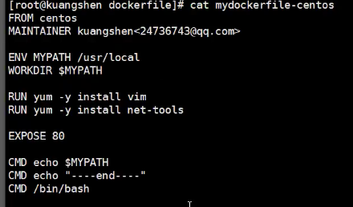

# Docker 入门
### 名词解释
* 容器 Container
* 镜像 Image
* 仓库 Repository
### Docker的安装
1. 树莓派安装
2. 配置文件更换镜像
### Hello world 的执行流程
### Docker 常用的命令
* `docker pull Nginx`下载镜像
* 查看所有镜像：`docker images`
* 开启一个容器
```
docker run -it -p 8080:8080 tomcat
docker run -d --name nginx01 -p 10010:80 nginx
# -d 后台运行
# --name 给该容器起别名
# -p 添加端口映射
```
* `docker history [id]`查看镜像构建过程
* `docker ps` 查看当前所有进程
* 开启一个容器，并让他和主机（宿主机）共享一个网络
```bash
docker run --name pmc01 --network host -it 63021699a0b9 /bin/bash
```
* 
```bash
docker run -p 10010:8080  -it fbcee2292447 /bin/bash ` 启动并切换目录
```
* `docker stop [id]` 停止一个进程

* 启动owncloud

    ```bash
    docker run -d --network host -v /data/owncloud/:/var/www/html owncloud
    ```

    

* `docker inspect [id]` 查看镜像元数据

* 进入当前正在运行的容器`docker exec -it [id] /bin/bash`
    
    * `docker attach [id]`: 当前正在执行的代码
    
* `docker cp [container's id]:/path /host/path` 将容器内文件拷贝出来

* control+p+q 

* 
```
docker ps -a | grep Exit | cut -d ' ' -f 1 | xargs docker rm 
```
删除所有关闭的容器
* 命令的小结： 
### 联合文件系统

#### 如何提交自己的镜像
* `docker commit -m="描述信息" -a="author" [id] [targetName:TAG]`

#### 自己如何制作一个镜像
***
### Docker容器数据卷
将容器内的目录，挂载在我们的Linux主机上。容器间共享数据

#### 挂载
* 启动一个自定义网络且具有文件挂载的容器：
```
docker run --name localhost -v /xftpPackage/:/ftptemp/  -e MYSQL_ROOT_PASSWORD=12345 --net mynet -it  0d64f46acfd1 /bin/bash
```
* 具名挂载:卷名：容器内路径 `docker run -it -v name:/container/path [id] /bin/bash --name [name]`
* 匿名挂载：-v 容器内路径
* 指定路径挂载：-v /宿主机路径：容器内路径[:ro rw]
* `docker volume ls`
* `docker volume inspect [name]`
* `--volumes-from [容器名]`
#### 基本命令
* `docker run -it -v /host/path:/container/path [id] /bin/bash --name [name]`
* `docker run -volume-from docker01 --name docker02 -it debian /bin/bash` 继承挂载
* host->docker01->docker02->docker03,杀死中间一环并不会导致数据无法共享，而是向上重新连接。例如docker02停止，03会衔接01

#### dockerfile:用来构建自己的镜像


* `docker build -f dockerfile -t [imagename]:[TAG] .`
* 容器之间的共享卷是拷贝的概念 

命令+参数+脚本，自定义镜像。每条指令都会提交一层
步骤：

##### dockerfile 命令: 

* `FROM` :基础镜像，一切的开始
* `MAINTAINER`: 
* `VOLUME` :容器挂载目录
* `CMD`:容器启动时要执行的命令
* `COPY`:将文件拷贝到镜像中
* `ENV`:环境变量
* 小试牛刀
* CMD和ENTRYPOINT的区别：
ENTRYPOINT可以追加命令，CMD只会执行最后输入的命令
* 自己制作一个tomcat镜像：

##### 发布自己的docker镜像
1. [dockerhub](hub.docker.com) 注册账号
2. 激活，并在本机登录
3. 在服务器上提交自己的镜像
```
docker login -u [] -p []
```
4. docker push [image name]
5. 发布到阿里云：

***
### 总结


### docker网络（容器互联）：docker0
1. 容器之间的连接,veth-pair充当桥梁进行连接.容器和容器之间可以互相ping通
2. Docker0 充当的是路由器，容器与容器之间通过路由器通讯
3. 所有容器在不指定网络的情况下，默认由docker0充当路由器
4. 缺点：无法通过域名访问，导致每次重新分配ip会很麻烦

#### 容器互联：--link
```
docker run -d -P --name tomcat03 --link tomcat02 [tomcat]
```
* 查看host网络配置：`docker exec -it tomcat03 cat /etc/hosts`

#### 自定义网络：
* 自定义网络
```
docker network create --driver bridge [name] --subnet 192.168.0.0/16 --gateway 192.168.0.1
```
自定义的网络非常完善，能够直接通过域名ping通容器。
* 指定启动网络:
```
docker -d -P --name tomcat-net-01 --network mynet tomcat
```
* redis -不同集群使用了不同的网络，保证集群的安全和健康

#### 网络连通：
一个容器两个ip
* `docker network connect [mynet:所要连接到的网络] [tomcat01]`
* `docker inspect mynet` 查看网络 
* `docker exec -it tomcat01 ping tomcat-net-01` 


