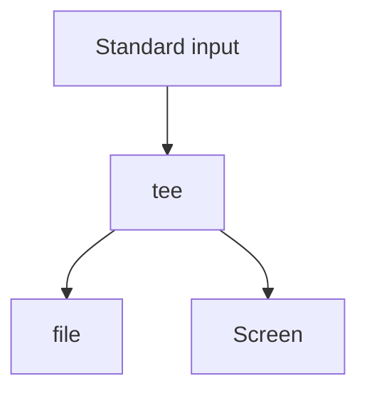
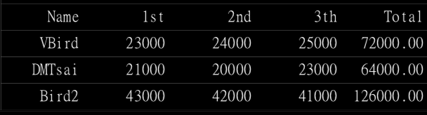

# 二刷鸟叔LINUX
### 目录详细解释
/etc/, /boot, /usr/bin, /bin, /usr/sbin, /sbin, /dev, /var/log, /run
* /etc/:几乎系统的所有配置文件案均在此，尤其 passwd,shadow o /boot:开机配置文件，也是预设摆放核心 vmlinuz 的地方
* /usr/bin, /bin:一般执行档摆放的地方
* /usr/sbin, /sbin:系统管理员常用指令集
* /dev:摆放所有系统装置文件的目录
* /var/log:摆放系统注册表文件的地方
* /run:CentOS 7 以后才有，将经常变动的项目(每次开机都不同，如程序的 PID)移动到内存暂存，所以 /run 并不占实际磁盘容量
* 
```bash
top -b -n1 | fgrep "Cpu(s)" | tail -1 | awk -F'id,' '{split($1, vs, ","); v=vs[length(vs)]; sub(/\s+/, "", v);sub(/\s+/, "", v); printf "%s\n", 100-v; }'
```
* 通过修改.bashrc文件可以自定义别名

***
### 常见指令记录
* pwd：显示当前目录
* rmdir:删除一个空的目录
* umask : 取消一个文件或者目录的部分权限 例如：002代表others会减少一个w写入权限
* grep 'processor' /proc/cpuinfo :查看cpu核数
* cd /lib/modules/$(uname -r)/kernel/fs/:查看系统支持的文件系统类型
* df:列出文件系统的基本信息
* dd:可从标准输入或文件中读取数据，根据指定的格式来转换数据，再输出到文件、设备或标准输出。
* 自定义别名：`alias ll='ls -al'`
* ctrl+u/k:删除整行
* ctrl+e/a:在输入命令行时移动光标到最前或最后
* bash中设置变量
* bash 中的反引号决定执行顺序 
```bash
ls -ld `locate crontab`
```
* 获取系统温度，问计算成摄氏度：
```bash
tem=$(cat /sys/class/thermal/thermal_zone0/temp); declare -i tem=$tem/1000

declare的参数选项：
选项与参数:
-a :将后面名为 variable 的变量定义成为数组 (array) 类型
-i :将后面名为 variable 的变量定义成为整数数字 (integer) 类型
-x :用法与 export 一样，就是将后面的 variable 变成环境变量;
-r :将变量设定成为 readonly 类型，该变量不可被更改内容，也不能 unset
```
* netstat:查看主机开放的端口
* source能即刻读取刚写入的shell变量
* 通配符和特殊符号在书的465页
* `lsb_release -a` 查看本机发行版本
* 查看主机位数`getconf LONG_BIT`

***
#### 管线命令：
* cut,多数情况和管道一起使用
```
选项与参数:
-d :后面接分隔字符。与 -f 一起使用;
-f :依据 -d 的分隔字符将一段讯息分区成为数段，用 -f 取出第几段的意思; 
-c :以字符 (characters) 的单位取出固定字符区间;
```
* **grep:**
```
选项与参数:
-a :将 binary 文件以 text 文件的方式搜寻数据
-c :计算找到 '搜寻字符串' 的次数
-i :忽略大小写的不同，所以大小写视为相同
-n :顺便输出行号
-v :反向选择，亦即显示出没有 '搜寻字符串' 内容的那一行!
-A :后面可加数字，为 after 的意思，除了列出该行外，后续的 n 行也列出来; 
-B :后面可加数字，为 befer 的意思，除了列出该行外，前面的 n 行也列出来; 
--color=auto 可将正确的那个撷取数据列出颜色
--color=auto :可以将找到的关键词部分加上颜色的显示喔!
```
* **sort**,对数据进行排序
```
[dmtsai@study ~]$ sort [-fbMnrtuk] [file or stdin] 选项与参数:
-f :忽略大小写的差异，例如 A 与 a 视为编码相同; -b :忽略最前面的空格符部分;
-M :以月份的名字来排序，例如 JAN, DEC 等等的排序方法; -n :使用『纯数字』进行排序(默认是以文字型态来排序的); -r :反向排序;
-u :就是 uniq ，相同的数据中，仅出现一行代表;
-t :分隔符，预设是用 [tab] 键来分隔; 
-k :以那个区间 (field) 来进行排序的意思
```
* **uniq**: 查重计数
```
[dmtsai@study ~]$ uniq [-ic] 选项与参数:
-i :忽略大小写字符的不同; -c :进行计数
```
* **wc**: 进行统计
例如统计根目录文件夹下有多少个文件(包括隐藏目录)：`ls -al | wc -l`
```
选项与参数:
-l :仅列出行;
-w :仅列出多少字(英文单字); 
-m :多少字符
```
* **tee**:双向重定向

```
选项与参数:
-a :以累加 (append) 的方式，将数据加入 file 当中!

ls -l / | tee -a ~/homefile | more
# 要注意! tee 后接的文件会被覆盖，若加上 -a 这个选项则能将讯息累加
```
* **tr**: 删除信息当中的文字，或替换
```
[dmtsai@study ~]$ tr [-ds] SET1 ... 选项与参数:
-d :删除讯息当中的 SET1 这个字符串;
-s :取代掉重复的字符!
```
* **join,paste**:都可以将两个文件依行合并
* **split**:将一个文件分成小文件
```
[dmtsai@study ~]$ split [-bl] file PREFIX
选项与参数:
-b :后面可接欲分区成的文件大小，可加单位，例如 b, k, m 等;
-l :以行数来进行分区。
PREFIX :代表前导符的意思，可作为分区文件的前导文字。
```
* **xargs**参数代换：有许多指令不支持管线
```
[dmtsai@study ~]$ xargs [-0epn] command
选项与参数:
-0 :如果输入的 stdin 含有特殊字符，例如 `, \, 空格键等等字符时，这个 -0 参数
可以将他还原成一般字符。这个参数可以用于特殊状态喔!
-e :这个是 EOF (end of file) 的意思。后面可以接一个字符串，当 xargs 分析到这个字符串时，
就会停止继续工作!
-p :在执行每个指令的 argument 时，都会询问使用者的意思;
-n :后面接次数，每次 command 指令执行时，要使用几个参数的意思。 当 xargs 后面没有接任何的指令时，默认是以 echo 来进行输出喔!
```
例子：`find /usr/sbin -perm /7000 | xargs ls -l`
* **-** ：取代前一个指令的stdout
***
### 正则表达式
* **sed**:
    * 例子：
```
[dmtsai@study ~]$ nl /etc/passwd | sed '2,5d'
     1  root:x:0:0:root:/root:/bin/bash
     6  sync:x:5:0:sync:/sbin:/bin/sync
     7  shutdown:x:6:0:shutdown:/sbin:/sbin/shutdown
```
```
[dmtsai@study ~]$ /sbin/ifconfig eth0 | grep 'inet ' | sed 's/^.*inet //g' \ > | sed 's/ *netmask.*$//g'
192.168.1.100
```
```
取kali的ip地址：
 ifconfig wlan0 | grep 'inet'| head -1| sed 's/^.*inet//g'| sed 's/ *netmask.*$//g'
```
* **printf**:格式化输出文件
```
$ printf '打印格式' 实际内容
选项与参数:
关于格式方面的几个特殊样式:
\a 警告声音输出
\b 退格键(backspace)
\f 清除屏幕 (form feed)
\n 输出新的一行
\r 亦即 Enter 按键
\t 水平的 [tab] 按键
\v 垂直的 [tab] 按键
\xNN NN 为两位数的数字，可以转换数字成为字符。
关于 C 程序语言内，常见的变数格式
%ns 那个 n 是数字， s 代表 string ，亦即多少个字符;
%ni 那个 n 是数字， i 代表 integer ，亦即多少整数字数;
%N.nf 那个 n 与 N 都是数字， f 代表 floating (浮点)，如果有小数字数，
假设我共要十个位数，但小数点有两位，即为 %10.2f 啰

例子：printf '%s\t %s\t %s\t %s\t %s\t \n' $(cat printf.txt)
```
* **awk**:
```
last -n 5 | awk '{print $1 "\t" $3}' dmtsai 192.168.1.100
dmtsai  192.168.1.100
dmtsai  192.168.1.100
dmtsai  192.168.1.100
```
```
需求：在 /etc/passwd 当中是以冒号 ":" 来作为字段的 分隔， 该文件中第一字段为账号，第三字段则是 UID。那假设我要查阅，第三栏小于 10 以下的数 据，并且仅列出账号与第三栏， 那么可以这样做
cat /etc/passwd | awk '{FS=":"} $3 < 10 {print $1 "\t " $3}'
```
```
cat pay.txt | \
> awk 'NR==1{printf "%10s %10s %10s %10s %10s\n",$1,$2,$3,$4,"Total" } > NR>=2{total = $2 + $3 + $4
> printf "%10s %10d %10d %10d %10.2f\n", $1, $2, $3, $4, total}'

```

***

#### 文档对比
* **diff**:对比文档
```
[dmtsai@study ~]$ diff [-bBi] from-file to-file
选项与参数:
from-file :一个档名，作为原始比对文件的档名;
to-file :一个档名，作为目的比对文件的档名;
注意，from-file 或 to-file 可以 - 取代，那个 - 代表『Standard input』之意。

-b :忽略一行当中，仅有多个空白的差异(例如 "about me" 与 "about me" 视为相同 
-B :忽略空白行的差异。
-i :忽略大小写的不同
```
* **cmp**:文件以字节为单位去对比，可以对比二进制的文件
```
$ cmp [-l] file1 file2
选项与参数:
-l :将所有的不同点的字节处都列出来。因为 cmp 预设仅会输出第一个发现的不同点。
```

* **pr**:文件打印：`pr /etc/man_db.conf`
***
### shell script
##### What is **shell script** :shell script 是利用 shell 的功能所写的一个『程序 (program)』，这个程序是使用纯文本文件，将一些 shell 的 语法与指令(含外部指令)写在里面， 搭配正规表示法、管线命令与数据流重导向等功能，以达到我们所想要的处理目的

* 获取日期
```
date1=$(date --date='2 days ago' +%Y%m%d)
date2=$(date --date='1 days ago' +%Y%m%d)
date3=$(date +%Y%m%d)
```

* source： 通过source命令来执行shell脚本，能够使得shell script中的变量变为全局变量
```		
[dmtsai@study bin]$ source showname.sh		
Please input your first name: VBird Please input your last name: Tsai
Your full name is: VBird Tsai
[dmtsai@study bin]$ echo ${firstname} ${lastname} VBird Tsai <==嘿嘿!有数据产生喔!
```

* test: 利用test指令对文件进行测试，具体的参数使用在书本**533**页
```
test -e /dmtsai && echo "exist" || echo "Not exist"
```

* []:利用中括号实现sh中的判断
```
read -p "Please input (Y/N): " yn
[ "${yn}" == "Y" -o "${yn}" == "y" ] && echo "OK, continue" && exit 0
[ "${yn}" == "N" -o "${yn}" == "n" ] && echo "Oh, interrupt!" && exit 0 echo "I don't know what your choice is" && exit 0
```

* 通过$符号来呼叫bi变量：
    * $# :代表后接的参数『个数』，以上表为例这里显示为『 4 』;
    * $@ :代表『 "$1" "$2" "$3" "$4" 』之意，每个变量是独立的(用双引号括起来);
    * $* :代表『 "$1c$2c$3c$4" 』，其中 c 为分隔字符，默认为空格键， 所以本例中代表『 "$1 $2 $3 $4"』

* shift : 参数向左位移
    * 「~~one~~ two three four five six」,shift 一次
    * 
* shell 执行调试参数：
```
[dmtsai@study ~]$ sh [-nvx] scripts.sh
选项与参数:
-n :不要执行 script，仅查询语法的问题;
-v :再执行 sccript 前，先将 scripts 的内容输出到屏幕上; 
-x :将使用到的 script 内容显示到屏幕上，这是很有用的参数!
```
***
### 系统服务：
#### 透过 systemctl 管理单一服务 (service unit) 的启动/开机启动与观察状态
* systemctl: 管理单一服务
```
[root@study ~]# systemctl [command] [unit] command 主要有:
start :立刻启动后面接的 unit
stop :立刻关闭后面接的 unit
restart:立刻关闭后启动后面接的 unit，亦即执行 stop 再 start 的意思
reload:不关闭后面接的 unit 的情况下，重载配置文件，让设定生效
enable:设定下次开机时，后面接的 unit 会被启动
disable:设定下次开机时，后面接的 unit 不会被启动
status:目前后面接的这个 unit 的状态，会列出有没有正在执行、开机预设执行否、登录等信息等! 
is-active:目前有没有正在运作中
is-enable:开机时有没有预设要启用这个 unit
```
#### 透过 systemctl 观察系统上所有的服务
```
command:
list-units :依据 unit 列出目前有启动的 unit。若加上 --all 才会列出没启动的。
list-unit-files :依据 /usr/lib/systemd/system/ 内的文件，将所有文件列表说明。 
--type=TYPE:就是之前提到的 unit type，主要有 service, socket, target 等
```
####
* `netstat -tlunp`:查看打开了的端口号
***
### 分析登录档档名
* 常见的登录档 802页
* 在`/etc/rsyslog.conf`中查看登录档配置
*** 
### Linux 开机流程分析
1. 加载 BIOS 的硬件信息与进行自我测试，并依据设定取得第一个可开机的装置;
2. 读取并执行第一个开机装置内 MBR 的 boot Loader (亦即是 grub2, spfdisk 等程序);
3. 依据 boot loader 的设定加载 Kernel ，Kernel 会开始侦测硬件与加载驱动程序;
4. 在硬件驱动成功后，Kernel 会主动呼叫 systemd 程序，并以 default.target 流程开机;
    1. systemd 执行 sysinit.target 初始化系统及 basic.target 准备操作系统;
    2. systemd 启动 multi-user.target 下的本机与服务器服务;
    3. systemd 执行 multi-user.target 下的 /etc/rc.d/rc.local 文件;
    4. systemd 执行 multi-user.target 下的 getty.target 及登入服务;
    5. systemd 执行 graphical 需要的服务

***
### 常见例题：
* 找出 /etc 底下，文件大小介于 50K 到 60K 之间的文件，并且将权限完整的列出 (ls -l):
    * find /etc -size +50k -a -size -60k -exec ls -l {} \;
    * 注意到 -a ，那个 -a 是 and 的意思，为符合两者才算成功
* 找出 /etc 底下，文件容量大于 50K 且文件所属人不是 root 的档名，且将权限完整的列出 (ls -l);
    * find /etc -size +50k ! -user root -exec ls -ld {}\
* 将 /etc/kdump.conf 内容取出后，(1)去除开头为 # 的行 (2)去除空白行 (3)取出开头为英文字母的那几行 (4) 最终统计总行数该如何进行?
    * `grep -v '^#' /etc/kdump.conf | grep -v '^$' | grep '^[[:alpha:]]' | wc -l`
***
### just for fun
* `vim /etc/motd`能够修改登录时的banner
* 
