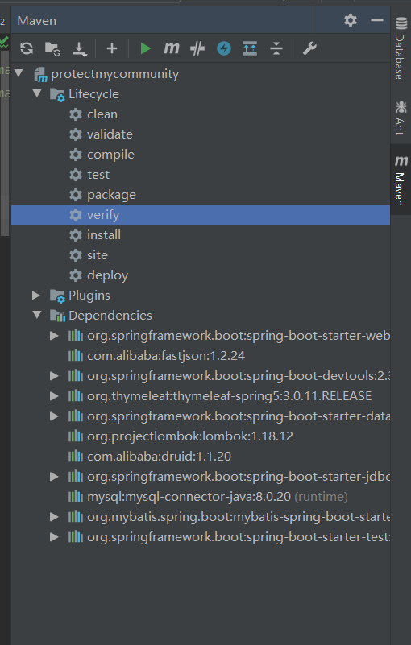

[TOC]

# Maven

[Maven仓库](https://mvnrepository.com/)

统一的规范

借助Maven，将jar包保存在仓库中，有需要时直接引用就好了。

服务于java平台的自动化构建工具

## Maven的环境搭建

* JDK
* Maven的安装包
* 环境变量：
   1. M2_HOME或Maven_HOME：bin的上一级
   2. path：bin

Eclipse 创建Maven工程

## Maven的核心概念

### 约定的目录结构


* 常用的命令：
   * mvn clean
   * mvn compile
   * mvn test
   * mvn install：对于直接写的工程要执行install 命令后，工程才能在本地仓库中被访问
   * mvn package：打包
   * mvn deploy:

> 在IDEA中直接使用：
>
> 

### POM

### 坐标（定位Maven工程）gav

==一定不重复==


1. groupid

   公司或者组织的域名倒叙+项目名

2. artifactid

   模块的名称

3. version

   > SNAP-SHOT表示的为当前版本时快照版本，不稳定
   >
   > RELEASE：表示发行版本 

   版本号

### 依赖:

```xml
<dependencies>
  <dependency>
    ....
  </dependency>
</dependencies>
```


#### 范围：

<scope> 依赖的范围，常用的有三种取值：

* compile：
   * 对主程序是否有效：有效
   * 对测试程序是否有效：有效
   * 是否参与打包：参与
* test：
   * 对主程序是否有效：无效
   * 对测试程序是否有效：有效
   * 是否参与打包：不参与
* provided：
   * 对主程序有效
   * 对测试程序有效
   * 不参与打包，由服务器提供
   * 不参与部署

#### 依赖的传递性：

 直接依赖，传递依赖 

> 当被依赖的包中导入了新的依赖，所有依赖这个包的包都会更新依赖，将依赖传递出去了
>
> ==注意==：非compile范围内的依赖不能传递

#### 依赖的排除

> ==需要设置依赖排除的场合：==不稳定的jar包，不希望加入当前工程

```xml
<dependencies>
  <dependency>
    <exclusion>
      ...坐标
    </exclusion>
  </dependency>
</dependencies>
```

如果在父类依赖中排出，子类也会被传递排除

#### 依赖的原则，依赖冲突

> 解决工程之间的jar包冲突问题

> 情境一：Maven中的解决原则：==路径最短者优先原则==。就近优先，以树状结构进行路径计算，将就近的冲突jar包依赖

>情景二：先声明者优先：在父类工程中哪个依赖先声明，哪个依赖中的依赖就先被依赖
>
>

### 统一管理版本号：

> 版本统一升级，如果手动一个一个改，不靠谱

==建议配置方式==：使用`<properties>`标签进行统一声明，然后在子项目中使用:

```xml
<properties>
  <com.qiumengke.version>
4.0.0.RELEASE  </com.qiumengke.version>
</properties>
```

然后使用`${com.qiumengke.version}`进行使用 

> properties不仅仅能使用在版本控制上，还可以统一字符编码。凡事需要统一声明的后再引用的场合都可以使用

### 仓库

#### 本地仓库

修改默认本地仓库位置，可以让Maven核心程序到我们实现准备好的目录下找：

在Maven 的安装目录下找到conf/setting.xml中修改LocalRepository标签


#### 远程仓库：私服 Nexus

> 首先Maven在私服上寻找，找不到时去中央仓库寻找

* 私服：假设在当前局域网的环境下，为当前局域网防伪内所有的Maven的工程服务
* 中央仓库：架设在Internet上，为全世界所有Maven工程服务
* 中央仓库镜像：架设在各大洲，为中央仓库分担流量。减轻中央仓库压力

#### 仓库中保存的内容：Maven工程

1. Maven自身锁需要的插件
2. 第三方的框架的Jar包
3. 我们自己开发的Maven工程


### 生命周期

各个构建环节执行的顺序：


和生命周期对应的是插件和目标，来帮助实现生命周期

### 继承

> 问题：由于junit模块的的scope是test，所以没办法进行传递依赖。所以要使用继承关系来解决这个问题
>
> 解决思路：将junit依赖统一提取到父工程中，在子工程中声明junit依赖时不指定版本，以父工程中统一的设定为准。同时便于修改
>
> 操作步骤：
>
> 1. 创建一个Maven工程作为父工程。注意打包的方式pom
>
>    
>
> 2. 在子工程中声明对父工程的引用
>
>    
>
> 3. 在子工程的坐标中父工程坐标中重复内容删除
>
> 4. 父工程中统一依赖
>
> 5. 在子工程中删除junit依赖的版本号部分

继承后要先build父工程再build子工程

### 聚合

> 解决的问题:
>
> 一件安装各个模块工程

在聚合工程的pom.xml文件上，进行maven install


> module顺序不讲究，ma ve会自动识别