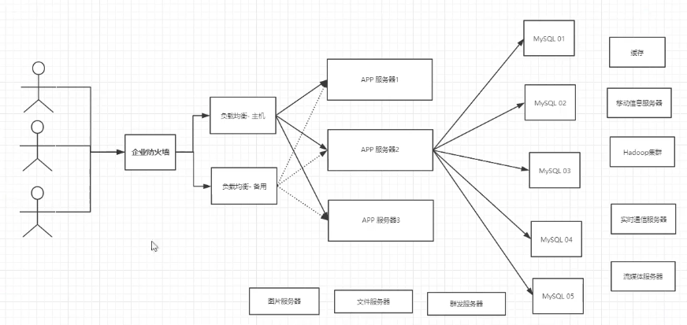
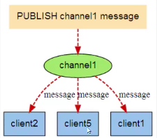
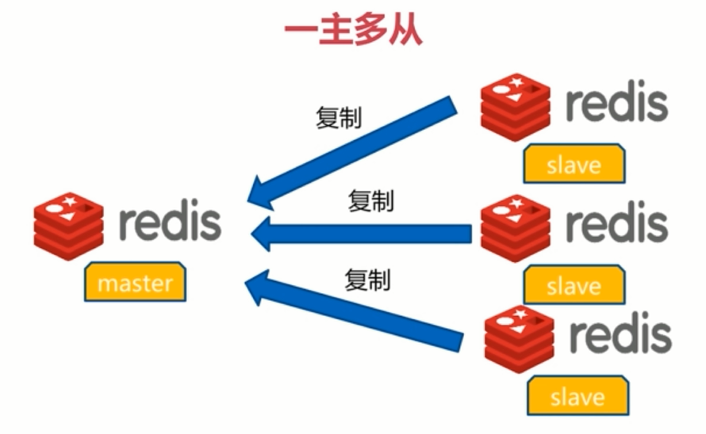

[TOC]

# Redis

> Nosql+RDBMS关系型数据库
>
> 应用：
>
> > * **数据库**
>
> > * **缓存**
>
> > * 消息中间件 mq


**互联网基本的架构：**



## 为什么要用Nosql(非关系型数据库)

### 3高

* 高并发

* 高可扩

* 高性能

### 3v

* Volume

* Variaty

* Velocity

### 持久化

1. RDB

2. AOF

## Redis 的安装

1. 从官网下载压缩包[redis官网](redis.io)

2. 更改配置文件，`daemonize yes`默认启动

3. 在src/目录下使用`redis-server [配置文件名称]`进行redis服务器启动

4. `redis-cli -h [host] -p [port]`启动客户端

5. 可以使用将`redis-server`以及`redis-cli`加入环境变量中

```bash
cp -l src/redis-server /usr/local/bin && cp -l src/redis-cli /usr/local/bin

\# -l:表示创建link连接文件
```

***

## redis基本指令

> #默认有16个数据库
>
> > #端口号：6379
> >
> > #redis是单线程的，基于内存操作
> >
> > #redis的瓶颈是内存和网络带宽
> >
> > #redis将所有的数据放在内存中，单线程效率最高
>
> 

* 先`shutdown`然后`exit`:退出redis
* `redis-server [conf/path]`:启动redis服务端
* `select 3`选择数据库，切换数据库
* `flushall` 清空数据库
* `flushdb` 清空当前数据库
* `keys *` 查看当前数据库所有数据
* `exists` 判断键是否存在
* `move [key] 1` 从指定数据库移除
* `expire [key] 10`设置过期的时间
* `ttl` 查看过期剩余的时间
* `type [key]`查看当前key的类型

### redis的基本数据类型

> **五大基本数据类型**

#### String

> 基本命令：

> * `strlen`:字符串长度
> * append`:追加字符串，如果当前key不存在，相当于set`
> * `incr`:加一
> *  `decr`:减一
> *  `incrby/decrby`:步长加减
> *  `getrange [from] [to]`: 查看一定范围的字符串
> *  `setrange [key] [from]`: 相当于java的从指定字符串位置进行替换
> *  `setex []`:设置过期时间
> *  `setnx []`:如果这个值不存在再执行设置
> *  `mset/msetnx`:批量设置值,mset是原子性的操作，一起失败
> *  `mget`:批量获取
> *  `set user:1:name zhangsan`:对象化设置值，复用
> *  `getset`:先get再set

#### list列表

> 可以模拟队列，栈
> 所有的list命令都是l开头
> * `[LR]PUSH [listname] [value]`:从左或者右插入
> * `LRANGE [listname] [from][to]`:按照范围查看
> * `lpop list`:移除list的第一个元素
> * `rpop list`:移除list最后一个元素
> * `lindex [listname] [下标]`:通过下标获得list中的某一个值
> * `llen [listname]`:返回列表长度
> * `lrem [listname] [数量] [key]`:移除list集合中指定的值
> * `ltrim [list] 1 2`:剪枝
> * `rpushlpop [source] [destination]`:移除最后一个元素，放到另一列表中
> * `lset`:在指定列表的指定下表设置值，如果存在就更新，不存在就报错
> * `linsert`:在指定位置插入新的值
>

#### Set

>Set中元素不能够重复，无顺序不重复集合
>
>* `sadd`:将set中添加值
>* `smembers`:获取所有元素
>* `sismember`:判断某一个元素是不是在set中
>* `srem [list Name] [key]`:移除某一个元素
>* `srandmember [list]`:随机取出一个key
>* `spop [list]`:随机移除元素
>* `smove [from list] [to list]`: 集合间的移动
>* `sdiff [key1] [key2]`:差集
>* `sinter [key1] [key2]`:交集
>* `sunion [key1] [key2]`:并集

#### Hash

>
>
>* `hset [setname] [key] [value]` :存储指定的key-value
>* `hget [hash name][key] `:获取指定的值
>* `hmset`:多值设置
>* `hmget`:多值获取
>* `hgetall`:获取所有keyvalue
>* `hlen`:hash表字段数量
>*  `hkeys`:
>* `hvals`:
>* `hincrby [hashname] [key] [num]`:
>* `hsetnx [hashname] [key] [value]`:如果不存在则设置 

#### Zset 有序集合

> * `zadd [list] [priority] [name]`:给添加的值设置优先级
> * `zrangebyscore [setname] -inf +inf`: 按照顺序排序
> * `zrevrangebyscore`:倒叙排列
> * `zcard [setname]`:获取有序集合的元素个数

***

##  Redis 三种特殊数据类型以及应用场景

###  **Geospatial**

> 应用场景：
>
> > * 推算两地之间的距离
> > * 探探附近的人
>
> 地理位置经纬度计算
>
> 底层的实现是zset:
>
> ```bash
> 127.0.0.1:6379> type china:city
> zset
> ```
>

>* ` geoadd`:添加地理位置
>
>* `geopos [china:city] [city]:`获取指定的城市的经度和纬度
>
>* `geodist [key] [city1] [city2]:`计算指定位置之间的距离
>
>   ```bash
>   geodist china:city beijing chongqing km
>   "1464.0708"
>   ```
>
>* `georadius`:查看指定为中心，指定半径内的元素
>
>   ```bash
>   127.0.0.1:6379> georadius key longitude latitude radius m|km|ft|mi [WITHCOORD]
>   ```
>
>* `georadiusbymember`:以成员为中心，来查询半径内的成员
>
>   ```bash
>   127.0.0.1:6379> georadiusbymember key member radius m|km|ft|mi [WITHCOORD] [WITH
>   ```
>

### **Hyperloglog 基数统计**

> 什么是基数？
>
> 一个集合去重复后的剩下的元素的个数

用来做基数统计的算法：

>网页的UV(统计一个网站的访问次数，去除重复ip)
>
> > 传统的方式利用set集合来保存用户id，然后统计set中的元素数量作为标准判断，这种方式会浪费大量的空间
>
>然而使用hyperloglog能够很好的解决这个问题，2^64^个不同的数据只需要耗费12kb的内存
>
>缺点是会有误差

#### 基本的命令使用：

* `pfadd`：添加元素

	```shell
	127.0.0.1:6379> pfadd key element [element ...]
	```

* `pfcount`:统计元素的数量

	```bash
	127.0.0.1:6379> pfcount key [key ...]
	```

* `pfmerge`:合并两组key

   ```
   127.0.0.1:6379> pfcount key [key ...] 
   ```

### **Bitmaps** 位存储

> * 统计用户信息
> * 活跃不活跃
> * 登录或者未登录
> * 打卡系统
> * 用0和1来代表两种结果

#### 基本命令

* `setbit`:

   ```bash
   127.0.0.1:6379> setbit key offset value
   ```

* `getbit`:

	```bash
	127.0.0.1:6379> getbit key offset
	```

* `bitcount`:

	```bash
 	bitcount key [start end]
	```

***

## Redis的基本事务操作

Redis 事务没有隔离级别的钙奶呢，事务不保证原子性

> Redis 事务的本质：一组命令的集合
>
> 可以理解为按照队列执行一组命令，按照顺序
>
> * 一次性
> * 顺序性
> * 排他性

#### Redis 的事务：

1. 开启事务
2. 命令入列
3. 执行事务

> 开启事务

`multi`:开启事务

> 放弃事务

`discard`：事务中的命令都不会被执行

> 命令入列

> 编译时异常：命令写错了
>
> 队列中所有的命令都不会执行成功
>
> ```shell
> 127.0.0.1:6379> multi
> OK
> 127.0.0.1:6379> set k1 1
> QUEUED
> 127.0.0.1:6379> set k2 2
> QUEUED
> 127.0.0.1:6379> gese
> (error) ERR unknown command `gese`, with args beginning with: 
> 127.0.0.1:6379> exec
> (error) EXECABORT Transaction discarded because of previous errors.
> ```

>运行时异常：
>
>运行时错误的命令行执行失败，其他的命令执行会成功 
>
>```shell
>127.0.0.1:6379> multi
>OK
>127.0.0.1:6379> set k1 1
>QUEUED
>127.0.0.1:6379> set k2 2
>QUEUED
>127.0.0.1:6379> set k3 3
>QUEUED
>127.0.0.1:6379> set k4 "k4"
>QUEUED
>127.0.0.1:6379> incr k4
>QUEUED
>127.0.0.1:6379> exec
>1) OK
>2) OK
>3) OK
>4) OK
>5) (error) ERR value is not an integer or out of rang
>```

## Redis的锁

悲观锁：

* 

乐观锁：

* 更新数据时判断，是否有人改动过数据 

* `watch [key]`:开启乐观锁监视，如果在事务执行时发现监视的值发生过改变，则会执行失败

   ```shell
   127.0.0.1:6379> set money 100
   OK
   127.0.0.1:6379> watch money
   OK
   127.0.0.1:6379> multi
   OK
   127.0.0.1:6379> incrby money 200
   QUEUED
   127.0.0.1:6379> decrby money 50
   QUEUED
   127.0.0.1:6379> exec
   (nil)
   127.0.0.1:6379> get money
   "10"
   
   ```

   执行过程中另一个客户端对	**money**的值进行了改动。

* `unwatch [key]`:解除监视

* 如果另一个终端对这个key 先进行改动过，又改回来原来的值，事务是否能够执行成功呢？

   > 不行！

***

## Jedis

指令基本相同

### 事务再次理解

  ### Springboot整合

> Spring data :操作数据

> 原来底层使用的jedis，替换成了lettuce，为什么？
>
> > 
>
> * 因为jedis采用的是直接连接，多个线程操作的话，是不安全的，如果想要避免不安全
> * 底层使用的lettuce，通过netty能够实现高并发，性能更加好

使用流程：

1. 导入依赖
2. 写入配置文件
   1. 配置端口号
   2. 服务器
   3. 集群
   4. 等等……
3. 测试
   1. `@Autowired` 装配上模版，可以自定义
   2. `redisTemplate.opsForValue()`来操作字符串
   3. `redisTemplate.opsForList()`来操作链表
   4. 其他的方法一样

####  序列化

所有的pojo类都需要序列化，只有这样在

```java
redisTemplate.opsForValue().set("user",user);
//user这个对象的类都过没有序列化的话是会报错的，无法存入redis服务器
```

> 自定义序列化方式：

> Redis配置模版：

```java
package com.kuang.config;

import com.fasterxml.jackson.annotation.JsonAutoDetect;
import com.fasterxml.jackson.annotation.PropertyAccessor;
import com.fasterxml.jackson.databind.ObjectMapper;
import org.springframework.context.annotation.Bean;
import org.springframework.context.annotation.Configuration;
import org.springframework.data.redis.connection.RedisConnectionFactory;
import org.springframework.data.redis.core.RedisTemplate;
import org.springframework.data.redis.serializer.Jackson2JsonRedisSerializer;
import org.springframework.data.redis.serializer.StringRedisSerializer;

import java.net.UnknownHostException;

@Configuration
public class RedisConfig {
    @Bean
    @SuppressWarnings("all")
    public RedisTemplate<String, Object> redisTemplate(RedisConnectionFactory redisConnectionFactory)
            throws UnknownHostException {
        RedisTemplate<String, Object> template = new RedisTemplate<>();
        template.setConnectionFactory(redisConnectionFactory);

        //Json序列化配置
        Jackson2JsonRedisSerializer jackson2JsonRedisSerializer = new Jackson2JsonRedisSerializer(Object.class);
        ObjectMapper om = new ObjectMapper();
        om.setVisibility(PropertyAccessor.ALL, JsonAutoDetect.Visibility.ANY);
        om.enableDefaultTyping(ObjectMapper.DefaultTyping.NON_FINAL);
        jackson2JsonRedisSerializer.setObjectMapper(om);
        //String的序列化
        StringRedisSerializer stringRedisSerializer = new StringRedisSerializer();
        //key采用String的序列化方式
        template.setKeySerializer(stringRedisSerializer);
        //hash的key也采用String的序列化方式
        template.setHashKeySerializer(stringRedisSerializer);
        //value序列化方式采用jackson
        template.setValueSerializer(jackson2JsonRedisSerializer);
        //hash的value的序列化方式采用jackson
        template.setHashValueSerializer(jackson2JsonRedisSerializer);

        template.afterPropertiesSet();

        return template;
    }

}
```

再通过：

```java
@Autowired
@Qualifier("redisTemplate")
private RedisTemplate redisTemplate;
//指定模版
```

> 封装工具类：

```java
package com.citydo.utils;

import org.springframework.data.redis.connection.DataType;
import org.springframework.data.redis.core.Cursor;
import org.springframework.data.redis.core.ScanOptions;
import org.springframework.data.redis.core.StringRedisTemplate;
import org.springframework.data.redis.core.ZSetOperations.TypedTuple;

import java.util.Collection;
import java.util.Date;
import java.util.List;
import java.util.Map;
import java.util.Map.Entry;
import java.util.Set;
import java.util.concurrent.TimeUnit;

/**
 * Redis工具类*/
public class RedisUtil {
    private StringRedisTemplate redisTemplate;

    public void setRedisTemplate(StringRedisTemplate redisTemplate) {
        this.redisTemplate = redisTemplate;
    }

    public StringRedisTemplate getRedisTemplate() {
        return this.redisTemplate;
    }

    /** -------------------key相关操作--------------------- */

    /**
     * 删除key
     * 
     * @param key
     */
    public void delete(String key) {
        redisTemplate.delete(key);
    }

    /**
     * 批量删除key
     * 
     * @param keys
     */
    public void delete(Collection<String> keys) {
        redisTemplate.delete(keys);
    }

    /**
     * 序列化key
     * 
     * @param key
     * @return
     */
    public byte[] dump(String key) {
        return redisTemplate.dump(key);
    }

    /**
     * 是否存在key
     * 
     * @param key
     * @return
     */
    public Boolean hasKey(String key) {
        return redisTemplate.hasKey(key);
    }

    /**
     * 设置过期时间
     * 
     * @param key
     * @param timeout
     * @param unit
     * @return
     */
    public Boolean expire(String key, long timeout, TimeUnit unit) {
        return redisTemplate.expire(key, timeout, unit);
    }

    /**
     * 设置过期时间
     * 
     * @param key
     * @param date
     * @return
     */
    public Boolean expireAt(String key, Date date) {
        return redisTemplate.expireAt(key, date);
    }

    /**
     * 查找匹配的key
     * 
     * @param pattern
     * @return
     */
    public Set<String> keys(String pattern) {
        return redisTemplate.keys(pattern);
    }

    /**
     * 将当前数据库的 key 移动到给定的数据库 db 当中
     * 
     * @param key
     * @param dbIndex
     * @return
     */
    public Boolean move(String key, int dbIndex) {
        return redisTemplate.move(key, dbIndex);
    }

    /**
     * 移除 key 的过期时间，key 将持久保持
     * 
     * @param key
     * @return
     */
    public Boolean persist(String key) {
        return redisTemplate.persist(key);
    }

    /**
     * 返回 key 的剩余的过期时间
     * 
     * @param key
     * @param unit
     * @return
     */
    public Long getExpire(String key, TimeUnit unit) {
        return redisTemplate.getExpire(key, unit);
    }

    /**
     * 返回 key 的剩余的过期时间
     * 
     * @param key
     * @return
     */
    public Long getExpire(String key) {
        return redisTemplate.getExpire(key);
    }

    /**
     * 从当前数据库中随机返回一个 key
     * 
     * @return
     */
    public String randomKey() {
        return redisTemplate.randomKey();
    }

    /**
     * 修改 key 的名称
     * 
     * @param oldKey
     * @param newKey
     */
    public void rename(String oldKey, String newKey) {
        redisTemplate.rename(oldKey, newKey);
    }

    /**
     * 仅当 newkey 不存在时，将 oldKey 改名为 newkey
     * 
     * @param oldKey
     * @param newKey
     * @return
     */
    public Boolean renameIfAbsent(String oldKey, String newKey) {
        return redisTemplate.renameIfAbsent(oldKey, newKey);
    }

    /**
     * 返回 key 所储存的值的类型
     * 
     * @param key
     * @return
     */
    public DataType type(String key) {
        return redisTemplate.type(key);
    }

    /** -------------------string相关操作--------------------- */

    /**
     * 设置指定 key 的值
     * @param key
     * @param value
     */
    public void set(String key, String value) {
        redisTemplate.opsForValue().set(key, value);
    }

    /**
     * 获取指定 key 的值
     * @param key
     * @return
     */
    public String get(String key) {
        return redisTemplate.opsForValue().get(key);
    }

    /**
     * 返回 key 中字符串值的子字符
     * @param key
     * @param start
     * @param end
     * @return
     */
    public String getRange(String key, long start, long end) {
        return redisTemplate.opsForValue().get(key, start, end);
    }

    /**
     * 将给定 key 的值设为 value ，并返回 key 的旧值(old value)
     * 
     * @param key
     * @param value
     * @return
     */
    public String getAndSet(String key, String value) {
        return redisTemplate.opsForValue().getAndSet(key, value);
    }

    /**
     * 对 key 所储存的字符串值，获取指定偏移量上的位(bit)
     * 
     * @param key
     * @param offset
     * @return
     */
    public Boolean getBit(String key, long offset) {
        return redisTemplate.opsForValue().getBit(key, offset);
    }

    /**
     * 批量获取
     * 
     * @param keys
     * @return
     */
    public List<String> multiGet(Collection<String> keys) {
        return redisTemplate.opsForValue().multiGet(keys);
    }

    /**
     * 设置ASCII码, 字符串'a'的ASCII码是97, 转为二进制是'01100001', 此方法是将二进制第offset位值变为value
     * 
     * @param key 位置
     * @param value
     *            值,true为1, false为0
     * @return
     */
    public boolean setBit(String key, long offset, boolean value) {
        return redisTemplate.opsForValue().setBit(key, offset, value);
    }

    /**
     * 将值 value 关联到 key ，并将 key 的过期时间设为 timeout
     * 
     * @param key
     * @param value
     * @param timeout
     *            过期时间
     * @param unit
     *            时间单位, 天:TimeUnit.DAYS 小时:TimeUnit.HOURS 分钟:TimeUnit.MINUTES
     *            秒:TimeUnit.SECONDS 毫秒:TimeUnit.MILLISECONDS
     */
    public void setEx(String key, String value, long timeout, TimeUnit unit) {
        redisTemplate.opsForValue().set(key, value, timeout, unit);
    }

    /**
     * 只有在 key 不存在时设置 key 的值
     * 
     * @param key
     * @param value
     * @return 之前已经存在返回false,不存在返回true
     */
    public boolean setIfAbsent(String key, String value) {
        return redisTemplate.opsForValue().setIfAbsent(key, value);
    }

    /**
     * 用 value 参数覆写给定 key 所储存的字符串值，从偏移量 offset 开始
     * 
     * @param key
     * @param value
     * @param offset
     *            从指定位置开始覆写
     */
    public void setRange(String key, String value, long offset) {
        redisTemplate.opsForValue().set(key, value, offset);
    }

    /**
     * 获取字符串的长度
     * 
     * @param key
     * @return
     */
    public Long size(String key) {
        return redisTemplate.opsForValue().size(key);
    }

    /**
     * 批量添加
     * 
     * @param maps
     */
    public void multiSet(Map<String, String> maps) {
        redisTemplate.opsForValue().multiSet(maps);
    }

    /**
     * 同时设置一个或多个 key-value 对，当且仅当所有给定 key 都不存在
     * 
     * @param maps
     * @return 之前已经存在返回false,不存在返回true
     */
    public boolean multiSetIfAbsent(Map<String, String> maps) {
        return redisTemplate.opsForValue().multiSetIfAbsent(maps);
    }

    /**
     * 增加(自增长), 负数则为自减
     * 
     * @param key
     * @return
     */
    public Long incrBy(String key, long increment) {
        return redisTemplate.opsForValue().increment(key, increment);
    }

    /**
     * 
     * @param key
     * @return
     */
    public Double incrByFloat(String key, double increment) {
        return redisTemplate.opsForValue().increment(key, increment);
    }

    /**
     * 追加到末尾
     * 
     * @param key
     * @param value
     * @return
     */
    public Integer append(String key, String value) {
        return redisTemplate.opsForValue().append(key, value);
    }

    /** -------------------hash相关操作------------------------- */

    /**
     * 获取存储在哈希表中指定字段的值
     * 
     * @param key
     * @param field
     * @return
     */
    public Object hGet(String key, String field) {
        return redisTemplate.opsForHash().get(key, field);
    }

    /**
     * 获取所有给定字段的值
     * 
     * @param key
     * @return
     */
    public Map<Object, Object> hGetAll(String key) {
        return redisTemplate.opsForHash().entries(key);
    }

    /**
     * 获取所有给定字段的值
     * 
     * @param key
     * @param fields
     * @return
     */
    public List<Object> hMultiGet(String key, Collection<Object> fields) {
        return redisTemplate.opsForHash().multiGet(key, fields);
    }

    public void hPut(String key, String hashKey, String value) {
        redisTemplate.opsForHash().put(key, hashKey, value);
    }

    public void hPutAll(String key, Map<String, String> maps) {
        redisTemplate.opsForHash().putAll(key, maps);
    }

    /**
     * 仅当hashKey不存在时才设置
     * 
     * @param key
     * @param hashKey
     * @param value
     * @return
     */
    public Boolean hPutIfAbsent(String key, String hashKey, String value) {
        return redisTemplate.opsForHash().putIfAbsent(key, hashKey, value);
    }

    /**
     * 删除一个或多个哈希表字段
     * 
     * @param key
     * @param fields
     * @return
     */
    public Long hDelete(String key, Object... fields) {
        return redisTemplate.opsForHash().delete(key, fields);
    }

    /**
     * 查看哈希表 key 中，指定的字段是否存在
     * 
     * @param key
     * @param field
     * @return
     */
    public boolean hExists(String key, String field) {
        return redisTemplate.opsForHash().hasKey(key, field);
    }

    /**
     * 为哈希表 key 中的指定字段的整数值加上增量 increment
     * 
     * @param key
     * @param field
     * @param increment
     * @return
     */
    public Long hIncrBy(String key, Object field, long increment) {
        return redisTemplate.opsForHash().increment(key, field, increment);
    }

    /**
     * 为哈希表 key 中的指定字段的整数值加上增量 increment
     * 
     * @param key
     * @param field
     * @param delta
     * @return
     */
    public Double hIncrByFloat(String key, Object field, double delta) {
        return redisTemplate.opsForHash().increment(key, field, delta);
    }

    /**
     * 获取所有哈希表中的字段
     * 
     * @param key
     * @return
     */
    public Set<Object> hKeys(String key) {
        return redisTemplate.opsForHash().keys(key);
    }

    /**
     * 获取哈希表中字段的数量
     * 
     * @param key
     * @return
     */
    public Long hSize(String key) {
        return redisTemplate.opsForHash().size(key);
    }

    /**
     * 获取哈希表中所有值
     * 
     * @param key
     * @return
     */
    public List<Object> hValues(String key) {
        return redisTemplate.opsForHash().values(key);
    }

    /**
     * 迭代哈希表中的键值对
     * 
     * @param key
     * @param options
     * @return
     */
    public Cursor<Entry<Object, Object>> hScan(String key, ScanOptions options) {
        return redisTemplate.opsForHash().scan(key, options);
    }

    /** ------------------------list相关操作---------------------------- */

    /**
     * 通过索引获取列表中的元素
     * 
     * @param key
     * @param index
     * @return
     */
    public String lIndex(String key, long index) {
        return redisTemplate.opsForList().index(key, index);
    }

    /**
     * 获取列表指定范围内的元素
     * 
     * @param key
     * @param start
     *            开始位置, 0是开始位置
     * @param end
     *            结束位置, -1返回所有
     * @return
     */
    public List<String> lRange(String key, long start, long end) {
        return redisTemplate.opsForList().range(key, start, end);
    }

    /**
     * 存储在list头部
     * 
     * @param key
     * @param value
     * @return
     */
    public Long lLeftPush(String key, String value) {
        return redisTemplate.opsForList().leftPush(key, value);
    }

    /**
     * 
     * @param key
     * @param value
     * @return
     */
    public Long lLeftPushAll(String key, String... value) {
        return redisTemplate.opsForList().leftPushAll(key, value);
    }

    /**
     * 
     * @param key
     * @param value
     * @return
     */
    public Long lLeftPushAll(String key, Collection<String> value) {
        return redisTemplate.opsForList().leftPushAll(key, value);
    }

    /**
     * 当list存在的时候才加入
     * 
     * @param key
     * @param value
     * @return
     */
    public Long lLeftPushIfPresent(String key, String value) {
        return redisTemplate.opsForList().leftPushIfPresent(key, value);
    }

    /**
     * 如果pivot存在,再pivot前面添加
     * 
     * @param key
     * @param pivot
     * @param value
     * @return
     */
    public Long lLeftPush(String key, String pivot, String value) {
        return redisTemplate.opsForList().leftPush(key, pivot, value);
    }

    /**
     * 
     * @param key
     * @param value
     * @return
     */
    public Long lRightPush(String key, String value) {
        return redisTemplate.opsForList().rightPush(key, value);
    }

    /**
     * 
     * @param key
     * @param value
     * @return
     */
    public Long lRightPushAll(String key, String... value) {
        return redisTemplate.opsForList().rightPushAll(key, value);
    }

    /**
     * 
     * @param key
     * @param value
     * @return
     */
    public Long lRightPushAll(String key, Collection<String> value) {
        return redisTemplate.opsForList().rightPushAll(key, value);
    }

    /**
     * 为已存在的列表添加值
     * 
     * @param key
     * @param value
     * @return
     */
    public Long lRightPushIfPresent(String key, String value) {
        return redisTemplate.opsForList().rightPushIfPresent(key, value);
    }

    /**
     * 在pivot元素的右边添加值
     * 
     * @param key
     * @param pivot
     * @param value
     * @return
     */
    public Long lRightPush(String key, String pivot, String value) {
        return redisTemplate.opsForList().rightPush(key, pivot, value);
    }

    /**
     * 通过索引设置列表元素的值
     * 
     * @param key
     * @param index
     *            位置
     * @param value
     */
    public void lSet(String key, long index, String value) {
        redisTemplate.opsForList().set(key, index, value);
    }

    /**
     * 移出并获取列表的第一个元素
     * 
     * @param key
     * @return 删除的元素
     */
    public String lLeftPop(String key) {
        return redisTemplate.opsForList().leftPop(key);
    }

    /**
     * 移出并获取列表的第一个元素， 如果列表没有元素会阻塞列表直到等待超时或发现可弹出元素为止
     * 
     * @param key
     * @param timeout
     *            等待时间
     * @param unit
     *            时间单位
     * @return
     */
    public String lBLeftPop(String key, long timeout, TimeUnit unit) {
        return redisTemplate.opsForList().leftPop(key, timeout, unit);
    }

    /**
     * 移除并获取列表最后一个元素
     * 
     * @param key
     * @return 删除的元素
     */
    public String lRightPop(String key) {
        return redisTemplate.opsForList().rightPop(key);
    }

    /**
     * 移出并获取列表的最后一个元素， 如果列表没有元素会阻塞列表直到等待超时或发现可弹出元素为止
     * 
     * @param key
     * @param timeout
     *            等待时间
     * @param unit
     *            时间单位
     * @return
     */
    public String lBRightPop(String key, long timeout, TimeUnit unit) {
        return redisTemplate.opsForList().rightPop(key, timeout, unit);
    }

    /**
     * 移除列表的最后一个元素，并将该元素添加到另一个列表并返回
     * 
     * @param sourceKey
     * @param destinationKey
     * @return
     */
    public String lRightPopAndLeftPush(String sourceKey, String destinationKey) {
        return redisTemplate.opsForList().rightPopAndLeftPush(sourceKey,
                destinationKey);
    }

    /**
     * 从列表中弹出一个值，将弹出的元素插入到另外一个列表中并返回它； 如果列表没有元素会阻塞列表直到等待超时或发现可弹出元素为止
     * 
     * @param sourceKey
     * @param destinationKey
     * @param timeout
     * @param unit
     * @return
     */
    public String lBRightPopAndLeftPush(String sourceKey, String destinationKey,
            long timeout, TimeUnit unit) {
        return redisTemplate.opsForList().rightPopAndLeftPush(sourceKey,
                destinationKey, timeout, unit);
    }

    /**
     * 删除集合中值等于value得元素
     * 
     * @param key
     * @param index
     *            index=0, 删除所有值等于value的元素; index>0, 从头部开始删除第一个值等于value的元素;
     *            index<0, 从尾部开始删除第一个值等于value的元素;
     * @param value
     * @return
     */
    public Long lRemove(String key, long index, String value) {
        return redisTemplate.opsForList().remove(key, index, value);
    }

    /**
     * 裁剪list
     * 
     * @param key
     * @param start
     * @param end
     */
    public void lTrim(String key, long start, long end) {
        redisTemplate.opsForList().trim(key, start, end);
    }

    /**
     * 获取列表长度
     * 
     * @param key
     * @return
     */
    public Long lLen(String key) {
        return redisTemplate.opsForList().size(key);
    }

    /** --------------------set相关操作-------------------------- */

    /**
     * set添加元素
     * 
     * @param key
     * @param values
     * @return
     */
    public Long sAdd(String key, String... values) {
        return redisTemplate.opsForSet().add(key, values);
    }

    /**
     * set移除元素
     * 
     * @param key
     * @param values
     * @return
     */
    public Long sRemove(String key, Object... values) {
        return redisTemplate.opsForSet().remove(key, values);
    }

    /**
     * 移除并返回集合的一个随机元素
     * 
     * @param key
     * @return
     */
    public String sPop(String key) {
        return redisTemplate.opsForSet().pop(key);
    }

    /**
     * 将元素value从一个集合移到另一个集合
     * 
     * @param key
     * @param value
     * @param destKey
     * @return
     */
    public Boolean sMove(String key, String value, String destKey) {
        return redisTemplate.opsForSet().move(key, value, destKey);
    }

    /**
     * 获取集合的大小
     * 
     * @param key
     * @return
     */
    public Long sSize(String key) {
        return redisTemplate.opsForSet().size(key);
    }

    /**
     * 判断集合是否包含value
     * 
     * @param key
     * @param value
     * @return
     */
    public Boolean sIsMember(String key, Object value) {
        return redisTemplate.opsForSet().isMember(key, value);
    }

    /**
     * 获取两个集合的交集
     * 
     * @param key
     * @param otherKey
     * @return
     */
    public Set<String> sIntersect(String key, String otherKey) {
        return redisTemplate.opsForSet().intersect(key, otherKey);
    }

    /**
     * 获取key集合与多个集合的交集
     * 
     * @param key
     * @param otherKeys
     * @return
     */
    public Set<String> sIntersect(String key, Collection<String> otherKeys) {
        return redisTemplate.opsForSet().intersect(key, otherKeys);
    }

    /**
     * key集合与otherKey集合的交集存储到destKey集合中
     * 
     * @param key
     * @param otherKey
     * @param destKey
     * @return
     */
    public Long sIntersectAndStore(String key, String otherKey, String destKey) {
        return redisTemplate.opsForSet().intersectAndStore(key, otherKey,
                destKey);
    }

    /**
     * key集合与多个集合的交集存储到destKey集合中
     * 
     * @param key
     * @param otherKeys
     * @param destKey
     * @return
     */
    public Long sIntersectAndStore(String key, Collection<String> otherKeys,
            String destKey) {
        return redisTemplate.opsForSet().intersectAndStore(key, otherKeys,
                destKey);
    }

    /**
     * 获取两个集合的并集
     * 
     * @param key
     * @param otherKeys
     * @return
     */
    public Set<String> sUnion(String key, String otherKeys) {
        return redisTemplate.opsForSet().union(key, otherKeys);
    }

    /**
     * 获取key集合与多个集合的并集
     * 
     * @param key
     * @param otherKeys
     * @return
     */
    public Set<String> sUnion(String key, Collection<String> otherKeys) {
        return redisTemplate.opsForSet().union(key, otherKeys);
    }

    /**
     * key集合与otherKey集合的并集存储到destKey中
     * 
     * @param key
     * @param otherKey
     * @param destKey
     * @return
     */
    public Long sUnionAndStore(String key, String otherKey, String destKey) {
        return redisTemplate.opsForSet().unionAndStore(key, otherKey, destKey);
    }

    /**
     * key集合与多个集合的并集存储到destKey中
     * 
     * @param key
     * @param otherKeys
     * @param destKey
     * @return
     */
    public Long sUnionAndStore(String key, Collection<String> otherKeys,
            String destKey) {
        return redisTemplate.opsForSet().unionAndStore(key, otherKeys, destKey);
    }

    /**
     * 获取两个集合的差集
     * 
     * @param key
     * @param otherKey
     * @return
     */
    public Set<String> sDifference(String key, String otherKey) {
        return redisTemplate.opsForSet().difference(key, otherKey);
    }

    /**
     * 获取key集合与多个集合的差集
     * 
     * @param key
     * @param otherKeys
     * @return
     */
    public Set<String> sDifference(String key, Collection<String> otherKeys) {
        return redisTemplate.opsForSet().difference(key, otherKeys);
    }

    /**
     * key集合与otherKey集合的差集存储到destKey中
     * 
     * @param key
     * @param otherKey
     * @param destKey
     * @return
     */
    public Long sDifference(String key, String otherKey, String destKey) {
        return redisTemplate.opsForSet().differenceAndStore(key, otherKey,
                destKey);
    }

    /**
     * key集合与多个集合的差集存储到destKey中
     * 
     * @param key
     * @param otherKeys
     * @param destKey
     * @return
     */
    public Long sDifference(String key, Collection<String> otherKeys,
            String destKey) {
        return redisTemplate.opsForSet().differenceAndStore(key, otherKeys,
                destKey);
    }

    /**
     * 获取集合所有元素
     * 
     * @param key
     * @return
     */
    public Set<String> setMembers(String key) {
        return redisTemplate.opsForSet().members(key);
    }

    /**
     * 随机获取集合中的一个元素
     * 
     * @param key
     * @return
     */
    public String sRandomMember(String key) {
        return redisTemplate.opsForSet().randomMember(key);
    }

    /**
     * 随机获取集合中count个元素
     * 
     * @param key
     * @param count
     * @return
     */
    public List<String> sRandomMembers(String key, long count) {
        return redisTemplate.opsForSet().randomMembers(key, count);
    }

    /**
     * 随机获取集合中count个元素并且去除重复的
     * 
     * @param key
     * @param count
     * @return
     */
    public Set<String> sDistinctRandomMembers(String key, long count) {
        return redisTemplate.opsForSet().distinctRandomMembers(key, count);
    }

    /**
     * 
     * @param key
     * @param options
     * @return
     */
    public Cursor<String> sScan(String key, ScanOptions options) {
        return redisTemplate.opsForSet().scan(key, options);
    }

    /**------------------zSet相关操作--------------------------------*/
    
    /**
     * 添加元素,有序集合是按照元素的score值由小到大排列
     * 
     * @param key
     * @param value
     * @param score
     * @return
     */
    public Boolean zAdd(String key, String value, double score) {
        return redisTemplate.opsForZSet().add(key, value, score);
    }

    /**
     * 
     * @param key
     * @param values
     * @return
     */
    public Long zAdd(String key, Set<TypedTuple<String>> values) {
        return redisTemplate.opsForZSet().add(key, values);
    }

    /**
     * 
     * @param key
     * @param values
     * @return
     */
    public Long zRemove(String key, Object... values) {
        return redisTemplate.opsForZSet().remove(key, values);
    }

    /**
     * 增加元素的score值，并返回增加后的值
     * 
     * @param key
     * @param value
     * @param delta
     * @return
     */
    public Double zIncrementScore(String key, String value, double delta) {
        return redisTemplate.opsForZSet().incrementScore(key, value, delta);
    }

    /**
     * 返回元素在集合的排名,有序集合是按照元素的score值由小到大排列
     * 
     * @param key
     * @param value
     * @return 0表示第一位
     */
    public Long zRank(String key, Object value) {
        return redisTemplate.opsForZSet().rank(key, value);
    }

    /**
     * 返回元素在集合的排名,按元素的score值由大到小排列
     * 
     * @param key
     * @param value
     * @return
     */
    public Long zReverseRank(String key, Object value) {
        return redisTemplate.opsForZSet().reverseRank(key, value);
    }

    /**
     * 获取集合的元素, 从小到大排序
     * 
     * @param key
     * @param start
     *            开始位置
     * @param end
     *            结束位置, -1查询所有
     * @return
     */
    public Set<String> zRange(String key, long start, long end) {
        return redisTemplate.opsForZSet().range(key, start, end);
    }

    /**
     * 获取集合元素, 并且把score值也获取
     * 
     * @param key
     * @param start
     * @param end
     * @return
     */
    public Set<TypedTuple<String>> zRangeWithScores(String key, long start,
            long end) {
        return redisTemplate.opsForZSet().rangeWithScores(key, start, end);
    }

    /**
     * 根据Score值查询集合元素
     * 
     * @param key
     * @param min
     *            最小值
     * @param max
     *            最大值
     * @return
     */
    public Set<String> zRangeByScore(String key, double min, double max) {
        return redisTemplate.opsForZSet().rangeByScore(key, min, max);
    }

    /**
     * 根据Score值查询集合元素, 从小到大排序
     * 
     * @param key
     * @param min
     *            最小值
     * @param max
     *            最大值
     * @return
     */
    public Set<TypedTuple<String>> zRangeByScoreWithScores(String key,
            double min, double max) {
        return redisTemplate.opsForZSet().rangeByScoreWithScores(key, min, max);
    }

    /**
     * 
     * @param key
     * @param min
     * @param max
     * @param start
     * @param end
     * @return
     */
    public Set<TypedTuple<String>> zRangeByScoreWithScores(String key,
            double min, double max, long start, long end) {
        return redisTemplate.opsForZSet().rangeByScoreWithScores(key, min, max,
                start, end);
    }

    /**
     * 获取集合的元素, 从大到小排序
     * 
     * @param key
     * @param start
     * @param end
     * @return
     */
    public Set<String> zReverseRange(String key, long start, long end) {
        return redisTemplate.opsForZSet().reverseRange(key, start, end);
    }

    /**
     * 获取集合的元素, 从大到小排序, 并返回score值
     * 
     * @param key
     * @param start
     * @param end
     * @return
     */
    public Set<TypedTuple<String>> zReverseRangeWithScores(String key,
            long start, long end) {
        return redisTemplate.opsForZSet().reverseRangeWithScores(key, start,
                end);
    }

    /**
     * 根据Score值查询集合元素, 从大到小排序
     * 
     * @param key
     * @param min
     * @param max
     * @return
     */
    public Set<String> zReverseRangeByScore(String key, double min,
            double max) {
        return redisTemplate.opsForZSet().reverseRangeByScore(key, min, max);
    }

    /**
     * 根据Score值查询集合元素, 从大到小排序
     * 
     * @param key
     * @param min
     * @param max
     * @return
     */
    public Set<TypedTuple<String>> zReverseRangeByScoreWithScores(
            String key, double min, double max) {
        return redisTemplate.opsForZSet().reverseRangeByScoreWithScores(key,
                min, max);
    }

    /**
     * 
     * @param key
     * @param min
     * @param max
     * @param start
     * @param end
     * @return
     */
    public Set<String> zReverseRangeByScore(String key, double min,
            double max, long start, long end) {
        return redisTemplate.opsForZSet().reverseRangeByScore(key, min, max,
                start, end);
    }

    /**
     * 根据score值获取集合元素数量
     * 
     * @param key
     * @param min
     * @param max
     * @return
     */
    public Long zCount(String key, double min, double max) {
        return redisTemplate.opsForZSet().count(key, min, max);
    }

    /**
     * 获取集合大小
     * 
     * @param key
     * @return
     */
    public Long zSize(String key) {
        return redisTemplate.opsForZSet().size(key);
    }

    /**
     * 获取集合大小
     * 
     * @param key
     * @return
     */
    public Long zZCard(String key) {
        return redisTemplate.opsForZSet().zCard(key);
    }

    /**
     * 获取集合中value元素的score值
     * 
     * @param key
     * @param value
     * @return
     */
    public Double zScore(String key, Object value) {
        return redisTemplate.opsForZSet().score(key, value);
    }

    /**
     * 移除指定索引位置的成员
     * 
     * @param key
     * @param start
     * @param end
     * @return
     */
    public Long zRemoveRange(String key, long start, long end) {
        return redisTemplate.opsForZSet().removeRange(key, start, end);
    }

    /**
     * 根据指定的score值的范围来移除成员
     * 
     * @param key
     * @param min
     * @param max
     * @return
     */
    public Long zRemoveRangeByScore(String key, double min, double max) {
        return redisTemplate.opsForZSet().removeRangeByScore(key, min, max);
    }

    /**
     * 获取key和otherKey的并集并存储在destKey中
     * 
     * @param key
     * @param otherKey
     * @param destKey
     * @return
     */
    public Long zUnionAndStore(String key, String otherKey, String destKey) {
        return redisTemplate.opsForZSet().unionAndStore(key, otherKey, destKey);
    }

    /**
     * 
     * @param key
     * @param otherKeys
     * @param destKey
     * @return
     */
    public Long zUnionAndStore(String key, Collection<String> otherKeys,
            String destKey) {
        return redisTemplate.opsForZSet()
                .unionAndStore(key, otherKeys, destKey);
    }

    /**
     * 交集
     * 
     * @param key
     * @param otherKey
     * @param destKey
     * @return
     */
    public Long zIntersectAndStore(String key, String otherKey,
            String destKey) {
        return redisTemplate.opsForZSet().intersectAndStore(key, otherKey,
                destKey);
    }

    /**
     * 交集
     * 
     * @param key
     * @param otherKeys
     * @param destKey
     * @return
     */
    public Long zIntersectAndStore(String key, Collection<String> otherKeys,
            String destKey) {
        return redisTemplate.opsForZSet().intersectAndStore(key, otherKeys,
                destKey);
    }

    /**
     * 
     * @param key
     * @param options
     * @return
     */
    public Cursor<TypedTuple<String>> zScan(String key, ScanOptions options) {
        return redisTemplate.opsForZSet().scan(key, options);
    }
}
```

####  Redis 配置文件详解

> * 单位大小写不敏感
> * 网络，端口号
> * 引入别的配置文件
> * 通用配置
>    * 日志
>    * 快照，持久化
>    * 安全
>       * 设置redis登录密码
>    * 客户端限制
>    * 持久化
>       * aof

```properties
# Redis configuration file example.
# Redis 配置文件示例
# Note that in order to read the configuration file, Redis must be
# started with the file path as first argument:
# 为了能够让redis-server读到配置文件，必须把配置文件作为第一参数传入来启动redis-server,如下：
# ./redis-server /path/to/redis.conf

# Note on units: when memory size is needed, it is possible to specify
# it in the usual form of 1k 5GB 4M and so forth:
# 注意单位的使用：当需要定制内存大小时使用，区分不同的单位是有必要的
# 1k => 1000 bytes
# 1kb => 1024 bytes
# 1m => 1000000 bytes
# 1mb => 1024*1024 bytes
# 1g => 1000000000 bytes
# 1gb => 1024*1024*1024 bytes
#
# units are case insensitive so 1GB 1Gb 1gB are all the same.
# 单位是大小写不敏感的，因此1GB 1Gb 1gB的含义都相同

################################## INCLUDES ###################################
# 引入其他的配置文件

# Include one or more other config files here.  This is useful if you
# have a standard template that goes to all Redis servers but also need
# to customize a few per-server settings.  Include files can include
# other files, so use this wisely.
# 可以在此处引入其他的配置文件。这种配置方式在多集群配置时非常有用，你可以用来定制一些redis服务器端的配置# 文件。 
#
# Notice option "include" won't be rewritten by command "CONFIG REWRITE"
# from admin or Redis Sentinel. Since Redis always uses the last processed
# line as value of a configuration directive, you'd better put includes
# at the beginning of this file to avoid overwriting config change at runtime.

#	需要注意的是，include 不会被admin或是Redis sentinel模式的命令"CONFIG REWRITE"重写
# Redis始终会使用最后一个配置文件作为标准，因此最好将include配置放在前面。

# If instead you are interested in using includes to override configuration
# options, it is better to use include as the last line.

#	如果你想用引入的配置文件作为标准，则将include语句放在最后

# include /path/to/local.conf
# include /path/to/other.conf

################################## MODULES #####################################

# Load modules at startup. If the server is not able to load modules
# it will abort. It is possible to use multiple loadmodule directives.
# 在启动服务时加载模块，如果服务器无法加载，就会不进行加载
#
# loadmodule /path/to/my_module.so
# loadmodule /path/to/other_module.so

################################## NETWORK #####################################

# By default, if no "bind" configuration directive is specified, Redis listens
# for connections from all the network interfaces available on the server.
# It is possible to listen to just one or multiple selected interfaces using
# the "bind" configuration directive, followed by one or more IP addresses.
# 默认的，如果没有绑定指定的ip地址，那么redis服务器就能够被网络上所有的客户端所连接，举个例子， 
# 本机的回环地址是127.0.0.1，而内网的ip是192.168.3.13，外网的ip为47.242.66.244，这就意味着本机
# 的软件可以通过127.0.0.1:6379来连接redis,而内网中的其他设备可以通过192.168.3.13:6379来访问主机，
# 处于公网之下的其他主机可以通过主机的公网ip:47.242.66.245:6379访问本机的redis服务。
# Examples:
#
# bind 192.168.1.100 10.0.0.1
# bind 127.0.0.1 ::1
# 可以进行多ip绑定
# ~~~ WARNING ~~~ If the computer running Redis is directly exposed to the
# internet, binding to all the interfaces is dangerous and will expose the
# instance to everybody on the internet. So by default we uncomment the
# following bind directive, that will force Redis to listen only into
# the IPv4 loopback interface address (this means Redis will be able to
# accept connections only from clients running into the same computer it
# is running).
# 警告：如果本机直接将Redis中暴露在所有网络中，会有安全的风险。所以我们不建议这样做，而是将redis默认绑定
# 本机回环地址 127.0.0.1，这样一来只有本机上的客户端才能访问Redis服务器。
#
# IF YOU ARE SURE YOU WANT YOUR INSTANCE TO LISTEN TO ALL THE INTERFACES
# JUST COMMENT THE FOLLOWING LINE.
# 如果你想要将Redis服务器暴露在所有网络下，只需要将下面的绑定注释掉即可。
# ~~~~~~~~~~~~~~~~~~~~~~~~~~~~~~~~~~~~~~~~~~~~~~~~~~~~~~~~~~~~~~~~~~~~~~~~
bind 127.0.0.1

# Protected mode is a layer of security protection, in order to avoid that
# Redis instances left open on the internet are accessed and exploited.
# 保护模式是一种保护机制，用来保护暴露在网络中redis实例（主机）
# When protected mode is on and if:
# 保护模式设置为启动，且如果：
# 1) The server is not binding explicitly to a set of addresses using the
#    "bind" directive.
# 1) Redis没有明确的使用 "bind" 对ip地址进行绑定。 
# 2) No password is configured.
# 2) 没有设置密码
#
# The server only accepts connections from clients connecting from the
# IPv4 and IPv6 loopback addresses 127.0.0.1 and ::1, and from Unix domain
# sockets.
# Redis服务器只会接受来自本地回环地址127.0.0.1(ipv4)或::1(ipv6)且通过Unix domain sockets连接的客户端。
#
# By default protected mode is enabled. You should disable it only if
# you are sure you want clients from other hosts to connect to Redis
# even if no authentication is configured, nor a specific set of interfaces
# are explicitly listed using the "bind" directive.
# 保护模式是默认开启的，你可以在确认允许其他主机访问本机服务器的情况下将它关闭，这意味着其他的主机可以在非认证的条件下访问你的主机
protected-mode yes

# Accept connections on the specified port, default is 6379 (IANA #815344).
# If port 0 is specified Redis will not listen on a TCP socket.
# 默认的连接端口是6379，如果将其设置为0，则会不允许其他客户端通过tcp端口建立连接
port 6379

# TCP listen() backlog.
#
# In high requests-per-second environments you need an high backlog in order
# to avoid slow clients connections issues. Note that the Linux kernel
# will silently truncate it to the value of /proc/sys/net/core/somaxconn so
# make sure to raise both the value of somaxconn and tcp_max_syn_backlog
# in order to get the desired effect.
# 在高并发，高负载的使用环境下，你可能需要更大监听队列，从而避免客户端的连接速度变慢，那么就可以通过更改以下的值来完成需要值得注意的是，如果自己设定的backlog值大于了linux内核参数所限制的somaxconn的大小，则会以linux内核的参数为准/proc/sys/net/core/somaxconn
tcp-backlog 511

# Unix socket.
# 
# Specify the path for the Unix socket that will be used to listen for
# incoming connections. There is no default, so Redis will not listen
# on a unix socket when not specified.
#
# unixsocket /tmp/redis.sock
# unixsocketperm 700

# Close the connection after a client is idle for N seconds (0 to disable)
# 在客户端闲置，不对服务端进行操作N秒后断开连接，默认0为不断开
timeout 0

# TCP keepalive.
# 保持TCP连接
# If non-zero, use SO_KEEPALIVE to send TCP ACKs to clients in absence
# of communication. This is useful for two reasons:
# 如果此参数设置为非零，那么会在每个间隔时间点向客户端发送一个确认ACK来确保连接：
# 1) Detect dead peers.扫描已不再被使用了的客户端
# 2) Take the connection alive from the point of view of network
#    equipment in the middle.保持客户端连接
#
# On Linux, the specified value (in seconds) is the period used to send ACKs.
# Note that to close the connection the double of the time is needed.
# On other kernels the period depends on the kernel configuration.
# 
# A reasonable value for this option is 300 seconds, which is the new
# Redis default starting with Redis 3.2.1.
tcp-keepalive 300

################################# TLS/SSL #####################################

# By default, TLS/SSL is disabled. To enable it, the "tls-port" configuration
# directive can be used to define TLS-listening ports. To enable TLS on the
# default port, use:
#
# port 0
# tls-port 6379

# Configure a X.509 certificate and private key to use for authenticating the
# server to connected clients, masters or cluster peers.  These files should be
# PEM formatted.
#
# tls-cert-file redis.crt 
# tls-key-file redis.key

# Configure a DH parameters file to enable Diffie-Hellman (DH) key exchange:
#
# tls-dh-params-file redis.dh

# Configure a CA certificate(s) bundle or directory to authenticate TLS/SSL
# clients and peers.  Redis requires an explicit configuration of at least one
# of these, and will not implicitly use the system wide configuration.
#
# tls-ca-cert-file ca.crt
# tls-ca-cert-dir /etc/ssl/certs

# By default, clients (including replica servers) on a TLS port are required
# to authenticate using valid client side certificates.
#
# If "no" is specified, client certificates are not required and not accepted.
# If "optional" is specified, client certificates are accepted and must be
# valid if provided, but are not required.
#
# tls-auth-clients no
# tls-auth-clients optional

# By default, a Redis replica does not attempt to establish a TLS connection
# with its master.
#
# Use the following directive to enable TLS on replication links.
#
# tls-replication yes

# By default, the Redis Cluster bus uses a plain TCP connection. To enable
# TLS for the bus protocol, use the following directive:
#
# tls-cluster yes

# Explicitly specify TLS versions to support. Allowed values are case insensitive
# and include "TLSv1", "TLSv1.1", "TLSv1.2", "TLSv1.3" (OpenSSL >= 1.1.1) or
# any combination. To enable only TLSv1.2 and TLSv1.3, use:
#
# tls-protocols "TLSv1.2 TLSv1.3"

# Configure allowed ciphers.  See the ciphers(1ssl) manpage for more information
# about the syntax of this string.
#
# Note: this configuration applies only to <= TLSv1.2.
#
# tls-ciphers DEFAULT:!MEDIUM

# Configure allowed TLSv1.3 ciphersuites.  See the ciphers(1ssl) manpage for more
# information about the syntax of this string, and specifically for TLSv1.3
# ciphersuites.
#
# tls-ciphersuites TLS_CHACHA20_POLY1305_SHA256

# When choosing a cipher, use the server's preference instead of the client
# preference. By default, the server follows the client's preference.
#
# tls-prefer-server-ciphers yes

# By default, TLS session caching is enabled to allow faster and less expensive
# reconnections by clients that support it. Use the following directive to disable
# caching.
#
# tls-session-caching no

# Change the default number of TLS sessions cached. A zero value sets the cache
# to unlimited size. The default size is 20480.
#
# tls-session-cache-size 5000

# Change the default timeout of cached TLS sessions. The default timeout is 300
# seconds.
#
# tls-session-cache-timeout 60

################################# GENERAL #####################################

# By default Redis does not run as a daemon. Use 'yes' if you need it.
# redis不会在后台运行，设置为yes来开启后台运行
# Note that Redis will write a pid file in /var/run/redis.pid when daemonized.
# Redis会在指定的path中写入一个pid文件
daemonize yes 

# If you run Redis from upstart or systemd, Redis can interact with your
# supervision tree. Options:
#   supervised no      - no supervision interaction
#   supervised upstart - signal upstart by putting Redis into SIGSTOP mode
#   supervised systemd - signal systemd by writing READY=1 to $NOTIFY_SOCKET
#   supervised auto    - detect upstart or systemd method based on
#                        UPSTART_JOB or NOTIFY_SOCKET environment variables
# Note: these supervision methods only signal "process is ready."
#       They do not enable continuous liveness pings back to your supervisor.
supervised no

# If a pid file is specified, Redis writes it where specified at startup
# and removes it at exit.
# 
# When the server runs non daemonized, no pid file is created if none is
# specified in the configuration. When the server is daemonized, the pid file
# is used even if not specified, defaulting to "/var/run/redis.pid".
#
# Creating a pid file is best effort: if Redis is not able to create it
# nothing bad happens, the server will start and run normally.
pidfile /var/run/redis_6379.pid

# Specify the server verbosity level.
# This can be one of:设置日志的信息的详细程度
# debug (a lot of information, useful for development/testing)
# verbose (many rarely useful info, but not a mess like the debug level)
# notice (moderately verbose, what you want in production probably)
# warning (only very important / critical messages are logged)
loglevel notice

# Specify the log file name. Also the empty string can be used to force
# Redis to log on the standard output. Note that if you use standard
# output for logging but daemonize, logs will be sent to /dev/null
# 自定义日志文件名字，如果是空的话就会直接标准输出并且不会被保存
logfile ""

# To enable logging to the system logger, just set 'syslog-enabled' to yes,
# and optionally update the other syslog parameters to suit your needs.
# syslog-enabled no

# Specify the syslog identity.
# syslog-ident redis

# Specify the syslog facility. Must be USER or between LOCAL0-LOCAL7.
# syslog-facility local0

# Set the number of databases. The default database is DB 0, you can select
# a different one on a per-connection basis using SELECT <dbid> where
# dbid is a number between 0 and 'databases'-1
# 设置数据的数量，默认是16，默认选择的是0号数据库
databases 16

# By default Redis shows an ASCII art logo only when started to log to the
# standard output and if the standard output is a TTY. Basically this means
# that normally a logo is displayed only in interactive sessions.
# 
# However it is possible to force the pre-4.0 behavior and always show a
# ASCII art logo in startup logs by setting the following option to yes.
# 开启服务时的redis log
always-show-logo yes

################################ SNAPSHOTTING  ################################
# 快照，持久化
# Save the DB on disk:
#
#   save <seconds> <changes>
#
#   Will save the DB if both the given number of seconds and the given
#   number of write operations against the DB occurred.
#
#   In the example below the behaviour will be to save:
#   after 900 sec (15 min) if at least 1 key changed
#   after 300 sec (5 min) if at least 10 keys changed
#   after 60 sec if at least 10000 keys changed
#
#   Note: you can disable saving completely by commenting out all "save" lines.
#
#   It is also possible to remove all the previously configured save
#   points by adding a save directive with a single empty string argument
#   like in the following example:
#
#   save ""

save 900 1
save 300 10
save 60 10000

# By default Redis will stop accepting writes if RDB snapshots are enabled
# (at least one save point) and the latest background save failed.
# This will make the user aware (in a hard way) that data is not persisting
# on disk properly, otherwise chances are that no one will notice and some
# disaster will happen.
#
# If the background saving process will start working again Redis will
# automatically allow writes again.
#
# However if you have setup your proper monitoring of the Redis server
# and persistence, you may want to disable this feature so that Redis will
# continue to work as usual even if there are problems with disk,
# permissions, and so forth.
stop-writes-on-bgsave-error yes

# Compress string objects using LZF when dump .rdb databases?
# For default that's set to 'yes' as it's almost always a win.
# If you want to save some CPU in the saving child set it to 'no' but
# the dataset will likely be bigger if you have compressible values or keys.
rdbcompression yes

# Since version 5 of RDB a CRC64 checksum is placed at the end of the file.
# This makes the format more resistant to corruption but there is a performance
# hit to pay (around 10%) when saving and loading RDB files, so you can disable it
# for maximum performances.
#
# RDB files created with checksum disabled have a checksum of zero that will
# tell the loading code to skip the check.
rdbchecksum yes

# The filename where to dump the DB
dbfilename dump.rdb

# Remove RDB files used by replication in instances without persistence
# enabled. By default this option is disabled, however there are environments
# where for regulations or other security concerns, RDB files persisted on
# disk by masters in order to feed replicas, or stored on disk by replicas
# in order to load them for the initial synchronization, should be deleted
# ASAP. Note that this option ONLY WORKS in instances that have both AOF
# and RDB persistence disabled, otherwise is completely ignored.
#
# An alternative (and sometimes better) way to obtain the same effect is
# to use diskless replication on both master and replicas instances. However
# in the case of replicas, diskless is not always an option.
rdb-del-sync-files no

# The working directory.
#
# The DB will be written inside this directory, with the filename specified
# above using the 'dbfilename' configuration directive.
#
# The Append Only File will also be created inside this directory.
#
# Note that you must specify a directory here, not a file name.
dir ./

################################# REPLICATION #################################

# Master-Replica replication. Use replicaof to make a Redis instance a copy of
# another Redis server. A few things to understand ASAP about Redis replication.
#
#   +------------------+      +---------------+
#   |      Master      | ---> |    Replica    |
#   | (receive writes) |      |  (exact copy) |
#   +------------------+      +---------------+
#
# 1) Redis replication is asynchronous, but you can configure a master to
#    stop accepting writes if it appears to be not connected with at least
#    a given number of replicas.
# 2) Redis replicas are able to perform a partial resynchronization with the
#    master if the replication link is lost for a relatively small amount of
#    time. You may want to configure the replication backlog size (see the next
#    sections of this file) with a sensible value depending on your needs.
# 3) Replication is automatic and does not need user intervention. After a
#    network partition replicas automatically try to reconnect to masters
#    and resynchronize with them.
# 配置主机，使自己成为从机
# replicaof <masterip> <masterport>

# If the master is password protected (using the "requirepass" configuration
# directive below) it is possible to tell the replica to authenticate before
# starting the replication synchronization process, otherwise the master will
# refuse the replica request.
#
# masterauth <master-password>
#
# However this is not enough if you are using Redis ACLs (for Redis version
# 6 or greater), and the default user is not capable of running the PSYNC
# command and/or other commands needed for replication. In this case it's
# better to configure a special user to use with replication, and specify the
# masteruser configuration as such:
#
# masteruser <username>
#
# When masteruser is specified, the replica will authenticate against its
# master using the new AUTH form: AUTH <username> <password>.

# When a replica loses its connection with the master, or when the replication
# is still in progress, the replica can act in two different ways:
#
# 1) if replica-serve-stale-data is set to 'yes' (the default) the replica will
#    still reply to client requests, possibly with out of date data, or the
#    data set may just be empty if this is the first synchronization.
#
# 2) if replica-serve-stale-data is set to 'no' the replica will reply with
#    an error "SYNC with master in progress" to all the kind of commands
#    but to INFO, replicaOF, AUTH, PING, SHUTDOWN, REPLCONF, ROLE, CONFIG,
#    SUBSCRIBE, UNSUBSCRIBE, PSUBSCRIBE, PUNSUBSCRIBE, PUBLISH, PUBSUB,
#    COMMAND, POST, HOST: and LATENCY.
#
replica-serve-stale-data yes

# You can configure a replica instance to accept writes or not. Writing against
# a replica instance may be useful to store some ephemeral data (because data
# written on a replica will be easily deleted after resync with the master) but
# may also cause problems if clients are writing to it because of a
# misconfiguration.
#
# Since Redis 2.6 by default replicas are read-only.
#
# Note: read only replicas are not designed to be exposed to untrusted clients
# on the internet. It's just a protection layer against misuse of the instance.
# Still a read only replica exports by default all the administrative commands
# such as CONFIG, DEBUG, and so forth. To a limited extent you can improve
# security of read only replicas using 'rename-command' to shadow all the
# administrative / dangerous commands.
replica-read-only yes

# Replication SYNC strategy: disk or socket.
#
# New replicas and reconnecting replicas that are not able to continue the
# replication process just receiving differences, need to do what is called a
# "full synchronization". An RDB file is transmitted from the master to the
# replicas.
#
# The transmission can happen in two different ways:
#
# 1) Disk-backed: The Redis master creates a new process that writes the RDB
#                 file on disk. Later the file is transferred by the parent
#                 process to the replicas incrementally.
# 2) Diskless: The Redis master creates a new process that directly writes the
#              RDB file to replica sockets, without touching the disk at all.
#
# With disk-backed replication, while the RDB file is generated, more replicas
# can be queued and served with the RDB file as soon as the current child
# producing the RDB file finishes its work. With diskless replication instead
# once the transfer starts, new replicas arriving will be queued and a new
# transfer will start when the current one terminates.
#
# When diskless replication is used, the master waits a configurable amount of
# time (in seconds) before starting the transfer in the hope that multiple
# replicas will arrive and the transfer can be parallelized.
#
# With slow disks and fast (large bandwidth) networks, diskless replication
# works better.
repl-diskless-sync no

# When diskless replication is enabled, it is possible to configure the delay
# the server waits in order to spawn the child that transfers the RDB via socket
# to the replicas.
#
# This is important since once the transfer starts, it is not possible to serve
# new replicas arriving, that will be queued for the next RDB transfer, so the
# server waits a delay in order to let more replicas arrive.
#
# The delay is specified in seconds, and by default is 5 seconds. To disable
# it entirely just set it to 0 seconds and the transfer will start ASAP.
repl-diskless-sync-delay 5

# -----------------------------------------------------------------------------
# WARNING: RDB diskless load is experimental. Since in this setup the replica
# does not immediately store an RDB on disk, it may cause data loss during
# failovers. RDB diskless load + Redis modules not handling I/O reads may also
# cause Redis to abort in case of I/O errors during the initial synchronization
# stage with the master. Use only if your do what you are doing.
# -----------------------------------------------------------------------------
#
# Replica can load the RDB it reads from the replication link directly from the
# socket, or store the RDB to a file and read that file after it was completely
# recived from the master.
#
# In many cases the disk is slower than the network, and storing and loading
# the RDB file may increase replication time (and even increase the master's
# Copy on Write memory and salve buffers).
# However, parsing the RDB file directly from the socket may mean that we have
# to flush the contents of the current database before the full rdb was
# received. For this reason we have the following options:
#
# "disabled"    - Don't use diskless load (store the rdb file to the disk first)
# "on-empty-db" - Use diskless load only when it is completely safe.
# "swapdb"      - Keep a copy of the current db contents in RAM while parsing
#                 the data directly from the socket. note that this requires
#                 sufficient memory, if you don't have it, you risk an OOM kill.
repl-diskless-load disabled

# Replicas send PINGs to server in a predefined interval. It's possible to
# change this interval with the repl_ping_replica_period option. The default
# value is 10 seconds.
#
# repl-ping-replica-period 10

# The following option sets the replication timeout for:
#
# 1) Bulk transfer I/O during SYNC, from the point of view of replica.
# 2) Master timeout from the point of view of replicas (data, pings).
# 3) Replica timeout from the point of view of masters (REPLCONF ACK pings).
#
# It is important to make sure that this value is greater than the value
# specified for repl-ping-replica-period otherwise a timeout will be detected
# every time there is low traffic between the master and the replica.
#
# repl-timeout 60

# Disable TCP_NODELAY on the replica socket after SYNC?
#
# If you select "yes" Redis will use a smaller number of TCP packets and
# less bandwidth to send data to replicas. But this can add a delay for
# the data to appear on the replica side, up to 40 milliseconds with
# Linux kernels using a default configuration.
#
# If you select "no" the delay for data to appear on the replica side will
# be reduced but more bandwidth will be used for replication.
#
# By default we optimize for low latency, but in very high traffic conditions
# or when the master and replicas are many hops away, turning this to "yes" may
# be a good idea.
repl-disable-tcp-nodelay no

# Set the replication backlog size. The backlog is a buffer that accumulates
# replica data when replicas are disconnected for some time, so that when a
# replica wants to reconnect again, often a full resync is not needed, but a
# partial resync is enough, just passing the portion of data the replica
# missed while disconnected.
#
# The bigger the replication backlog, the longer the time the replica can be
# disconnected and later be able to perform a partial resynchronization.
#
# The backlog is only allocated once there is at least a replica connected.
#
# repl-backlog-size 1mb

# After a master has no longer connected replicas for some time, the backlog
# will be freed. The following option configures the amount of seconds that
# need to elapse, starting from the time the last replica disconnected, for
# the backlog buffer to be freed.
#
# Note that replicas never free the backlog for timeout, since they may be
# promoted to masters later, and should be able to correctly "partially
# resynchronize" with the replicas: hence they should always accumulate backlog.
#
# A value of 0 means to never release the backlog.
#
# repl-backlog-ttl 3600

# The replica priority is an integer number published by Redis in the INFO
# output. It is used by Redis Sentinel in order to select a replica to promote
# into a master if the master is no longer working correctly.
#
# A replica with a low priority number is considered better for promotion, so
# for instance if there are three replicas with priority 10, 100, 25 Sentinel
# will pick the one with priority 10, that is the lowest.
#
# However a special priority of 0 marks the replica as not able to perform the
# role of master, so a replica with priority of 0 will never be selected by
# Redis Sentinel for promotion.
#
# By default the priority is 100.
replica-priority 100

# It is possible for a master to stop accepting writes if there are less than
# N replicas connected, having a lag less or equal than M seconds.
#
# The N replicas need to be in "online" state.
#
# The lag in seconds, that must be <= the specified value, is calculated from
# the last ping received from the replica, that is usually sent every second.
#
# This option does not GUARANTEE that N replicas will accept the write, but
# will limit the window of exposure for lost writes in case not enough replicas
# are available, to the specified number of seconds.
#
# For example to require at least 3 replicas with a lag <= 10 seconds use:
#
# min-replicas-to-write 3
# min-replicas-max-lag 10
#
# Setting one or the other to 0 disables the feature.
#
# By default min-replicas-to-write is set to 0 (feature disabled) and
# min-replicas-max-lag is set to 10.

# A Redis master is able to list the address and port of the attached
# replicas in different ways. For example the "INFO replication" section
# offers this information, which is used, among other tools, by
# Redis Sentinel in order to discover replica instances.
# Another place where this info is available is in the output of the
# "ROLE" command of a master.
#
# The listed IP and address normally reported by a replica is obtained
# in the following way:
#
#   IP: The address is auto detected by checking the peer address
#   of the socket used by the replica to connect with the master.
#
#   Port: The port is communicated by the replica during the replication
#   handshake, and is normally the port that the replica is using to
#   listen for connections.
#
# However when port forwarding or Network Address Translation (NAT) is
# used, the replica may be actually reachable via different IP and port
# pairs. The following two options can be used by a replica in order to
# report to its master a specific set of IP and port, so that both INFO
# and ROLE will report those values.
#
# There is no need to use both the options if you need to override just
# the port or the IP address.
#
# replica-announce-ip 5.5.5.5
# replica-announce-port 1234

############################### KEYS TRACKING #################################

# Redis implements server assisted support for client side caching of values.
# This is implemented using an invalidation table that remembers, using
# 16 millions of slots, what clients may have certain subsets of keys. In turn
# this is used in order to send invalidation messages to clients. Please
# to understand more about the feature check this page:
#
#   https://redis.io/topics/client-side-caching
#
# When tracking is enabled for a client, all the read only queries are assumed
# to be cached: this will force Redis to store information in the invalidation
# table. When keys are modified, such information is flushed away, and
# invalidation messages are sent to the clients. However if the workload is
# heavily dominated by reads, Redis could use more and more memory in order
# to track the keys fetched by many clients.
#
# For this reason it is possible to configure a maximum fill value for the
# invalidation table. By default it is set to 1M of keys, and once this limit
# is reached, Redis will start to evict keys in the invalidation table
# even if they were not modified, just to reclaim memory: this will in turn
# force the clients to invalidate the cached values. Basically the table
# maximum size is a trade off between the memory you want to spend server
# side to track information about who cached what, and the ability of clients
# to retain cached objects in memory.
#
# If you set the value to 0, it means there are no limits, and Redis will
# retain as many keys as needed in the invalidation table.
# In the "stats" INFO section, you can find information about the number of
# keys in the invalidation table at every given moment.
#
# Note: when key tracking is used in broadcasting mode, no memory is used
# in the server side so this setting is useless.
#
# tracking-table-max-keys 1000000

################################## SECURITY ###################################

# Warning: since Redis is pretty fast an outside user can try up to
# 1 million passwords per second against a modern box. This means that you
# should use very strong passwords, otherwise they will be very easy to break.
# Note that because the password is really a shared secret between the client
# and the server, and should not be memorized by any human, the password
# can be easily a long string from /dev/urandom or whatever, so by using a
# long and unguessable password no brute force attack will be possible.

# Redis ACL users are defined in the following format:
#
#   user <username> ... acl rules ...
#
# For example:
#
#   user worker +@list +@connection ~jobs:* on >ffa9203c493aa99
#
# The special username "default" is used for new connections. If this user
# has the "nopass" rule, then new connections will be immediately authenticated
# as the "default" user without the need of any password provided via the
# AUTH command. Otherwise if the "default" user is not flagged with "nopass"
# the connections will start in not authenticated state, and will require
# AUTH (or the HELLO command AUTH option) in order to be authenticated and
# start to work.
#
# The ACL rules that describe what an user can do are the following:
#
#  on           Enable the user: it is possible to authenticate as this user.
#  off          Disable the user: it's no longer possible to authenticate
#               with this user, however the already authenticated connections
#               will still work.
#  +<command>   Allow the execution of that command
#  -<command>   Disallow the execution of that command
#  +@<category> Allow the execution of all the commands in such category
#               with valid categories are like @admin, @set, @sortedset, ...
#               and so forth, see the full list in the server.c file where
#               the Redis command table is described and defined.
#               The special category @all means all the commands, but currently
#               present in the server, and that will be loaded in the future
#               via modules.
#  +<command>|subcommand    Allow a specific subcommand of an otherwise
#                           disabled command. Note that this form is not
#                           allowed as negative like -DEBUG|SEGFAULT, but
#                           only additive starting with "+".
#  allcommands  Alias for +@all. Note that it implies the ability to execute
#               all the future commands loaded via the modules system.
#  nocommands   Alias for -@all.
#  ~<pattern>   Add a pattern of keys that can be mentioned as part of
#               commands. For instance ~* allows all the keys. The pattern
#               is a glob-style pattern like the one of KEYS.
#               It is possible to specify multiple patterns.
#  allkeys      Alias for ~*
#  resetkeys    Flush the list of allowed keys patterns.
#  ><password>  Add this passowrd to the list of valid password for the user.
#               For example >mypass will add "mypass" to the list.
#               This directive clears the "nopass" flag (see later).
#  <<password>  Remove this password from the list of valid passwords.
#  nopass       All the set passwords of the user are removed, and the user
#               is flagged as requiring no password: it means that every
#               password will work against this user. If this directive is
#               used for the default user, every new connection will be
#               immediately authenticated with the default user without
#               any explicit AUTH command required. Note that the "resetpass"
#               directive will clear this condition.
#  resetpass    Flush the list of allowed passwords. Moreover removes the
#               "nopass" status. After "resetpass" the user has no associated
#               passwords and there is no way to authenticate without adding
#               some password (or setting it as "nopass" later).
#  reset        Performs the following actions: resetpass, resetkeys, off,
#               -@all. The user returns to the same state it has immediately
#               after its creation.
#
# ACL rules can be specified in any order: for instance you can start with
# passwords, then flags, or key patterns. However note that the additive
# and subtractive rules will CHANGE MEANING depending on the ordering.
# For instance see the following example:
#
#   user alice on +@all -DEBUG ~* >somepassword
#
# This will allow "alice" to use all the commands with the exception of the
# DEBUG command, since +@all added all the commands to the set of the commands
# alice can use, and later DEBUG was removed. However if we invert the order
# of two ACL rules the result will be different:
#
#   user alice on -DEBUG +@all ~* >somepassword
#
# Now DEBUG was removed when alice had yet no commands in the set of allowed
# commands, later all the commands are added, so the user will be able to
# execute everything.
#
# Basically ACL rules are processed left-to-right.
#
# For more information about ACL configuration please refer to
# the Redis web site at https://redis.io/topics/acl

# ACL LOG
#
# The ACL Log tracks failed commands and authentication events associated
# with ACLs. The ACL Log is useful to troubleshoot failed commands blocked 
# by ACLs. The ACL Log is stored in memory. You can reclaim memory with 
# ACL LOG RESET. Define the maximum entry length of the ACL Log below.
acllog-max-len 128

# Using an external ACL file
#
# Instead of configuring users here in this file, it is possible to use
# a stand-alone file just listing users. The two methods cannot be mixed:
# if you configure users here and at the same time you activate the exteranl
# ACL file, the server will refuse to start.
#
# The format of the external ACL user file is exactly the same as the
# format that is used inside redis.conf to describe users.
#
# aclfile /etc/redis/users.acl

# IMPORTANT NOTE: starting with Redis 6 "requirepass" is just a compatiblity
# layer on top of the new ACL system. The option effect will be just setting
# the password for the default user. Clients will still authenticate using
# AUTH <password> as usually, or more explicitly with AUTH default <password>
# if they follow the new protocol: both will work.
#
# requirepass foobared

# Command renaming (DEPRECATED).
#
# ------------------------------------------------------------------------
# WARNING: avoid using this option if possible. Instead use ACLs to remove
# commands from the default user, and put them only in some admin user you
# create for administrative purposes.
# ------------------------------------------------------------------------
#
# It is possible to change the name of dangerous commands in a shared
# environment. For instance the CONFIG command may be renamed into something
# hard to guess so that it will still be available for internal-use tools
# but not available for general clients.
#
# Example:
#
# rename-command CONFIG b840fc02d524045429941cc15f59e41cb7be6c52
#
# It is also possible to completely kill a command by renaming it into
# an empty string:
#
# rename-command CONFIG ""
#
# Please note that changing the name of commands that are logged into the
# AOF file or transmitted to replicas may cause problems.

################################### CLIENTS ####################################

# Set the max number of connected clients at the same time. By default
# this limit is set to 10000 clients, however if the Redis server is not
# able to configure the process file limit to allow for the specified limit
# the max number of allowed clients is set to the current file limit
# minus 32 (as Redis reserves a few file descriptors for internal uses).
#
# Once the limit is reached Redis will close all the new connections sending
# an error 'max number of clients reached'.
#
# IMPORTANT: When Redis Cluster is used, the max number of connections is also
# shared with the cluster bus: every node in the cluster will use two
# connections, one incoming and another outgoing. It is important to size the
# limit accordingly in case of very large clusters.
#
# maxclients 10000

############################## MEMORY MANAGEMENT ################################

# Set a memory usage limit to the specified amount of bytes.
# When the memory limit is reached Redis will try to remove keys
# according to the eviction policy selected (see maxmemory-policy).
#
# If Redis can't remove keys according to the policy, or if the policy is
# set to 'noeviction', Redis will start to reply with errors to commands
# that would use more memory, like SET, LPUSH, and so on, and will continue
# to reply to read-only commands like GET.
#
# This option is usually useful when using Redis as an LRU or LFU cache, or to
# set a hard memory limit for an instance (using the 'noeviction' policy).
#
# WARNING: If you have replicas attached to an instance with maxmemory on,
# the size of the output buffers needed to feed the replicas are subtracted
# from the used memory count, so that network problems / resyncs will
# not trigger a loop where keys are evicted, and in turn the output
# buffer of replicas is full with DELs of keys evicted triggering the deletion
# of more keys, and so forth until the database is completely emptied.
#
# In short... if you have replicas attached it is suggested that you set a lower
# limit for maxmemory so that there is some free RAM on the system for replica
# output buffers (but this is not needed if the policy is 'noeviction').
#
# maxmemory <bytes>

# MAXMEMORY POLICY: how Redis will select what to remove when maxmemory
# is reached. You can select one from the following behaviors:
#
# volatile-lru -> Evict using approximated LRU, only keys with an expire set.
# allkeys-lru -> Evict any key using approximated LRU.
# volatile-lfu -> Evict using approximated LFU, only keys with an expire set.
# allkeys-lfu -> Evict any key using approximated LFU.
# volatile-random -> Remove a random key having an expire set.
# allkeys-random -> Remove a random key, any key.
# volatile-ttl -> Remove the key with the nearest expire time (minor TTL)
# noeviction -> Don't evict anything, just return an error on write operations.
#
# LRU means Least Recently Used
# LFU means Least Frequently Used
#
# Both LRU, LFU and volatile-ttl are implemented using approximated
# randomized algorithms.
#
# Note: with any of the above policies, Redis will return an error on write
#       operations, when there are no suitable keys for eviction.
#
#       At the date of writing these commands are: set setnx setex append
#       incr decr rpush lpush rpushx lpushx linsert lset rpoplpush sadd
#       sinter sinterstore sunion sunionstore sdiff sdiffstore zadd zincrby
#       zunionstore zinterstore hset hsetnx hmset hincrby incrby decrby
#       getset mset msetnx exec sort
#
# The default is:
#
# maxmemory-policy noeviction

# LRU, LFU and minimal TTL algorithms are not precise algorithms but approximated
# algorithms (in order to save memory), so you can tune it for speed or
# accuracy. For default Redis will check five keys and pick the one that was
# used less recently, you can change the sample size using the following
# configuration directive.
#
# The default of 5 produces good enough results. 10 Approximates very closely
# true LRU but costs more CPU. 3 is faster but not very accurate.
#
# maxmemory-samples 5

# Starting from Redis 5, by default a replica will ignore its maxmemory setting
# (unless it is promoted to master after a failover or manually). It means
# that the eviction of keys will be just handled by the master, sending the
# DEL commands to the replica as keys evict in the master side.
#
# This behavior ensures that masters and replicas stay consistent, and is usually
# what you want, however if your replica is writable, or you want the replica
# to have a different memory setting, and you are sure all the writes performed
# to the replica are idempotent, then you may change this default (but be sure
# to understand what you are doing).
#
# Note that since the replica by default does not evict, it may end using more
# memory than the one set via maxmemory (there are certain buffers that may
# be larger on the replica, or data structures may sometimes take more memory
# and so forth). So make sure you monitor your replicas and make sure they
# have enough memory to never hit a real out-of-memory condition before the
# master hits the configured maxmemory setting.
#
# replica-ignore-maxmemory yes

# Redis reclaims expired keys in two ways: upon access when those keys are
# found to be expired, and also in background, in what is called the
# "active expire key". The key space is slowly and interactively scanned
# looking for expired keys to reclaim, so that it is possible to free memory
# of keys that are expired and will never be accessed again in a short time.
#
# The default effort of the expire cycle will try to avoid having more than
# ten percent of expired keys still in memory, and will try to avoid consuming
# more than 25% of total memory and to add latency to the system. However
# it is possible to increase the expire "effort" that is normally set to
# "1", to a greater value, up to the value "10". At its maximum value the
# system will use more CPU, longer cycles (and technically may introduce
# more latency), and will tollerate less already expired keys still present
# in the system. It's a tradeoff betweeen memory, CPU and latecy.
#
# active-expire-effort 1

############################# LAZY FREEING ####################################

# Redis has two primitives to delete keys. One is called DEL and is a blocking
# deletion of the object. It means that the server stops processing new commands
# in order to reclaim all the memory associated with an object in a synchronous
# way. If the key deleted is associated with a small object, the time needed
# in order to execute the DEL command is very small and comparable to most other
# O(1) or O(log_N) commands in Redis. However if the key is associated with an
# aggregated value containing millions of elements, the server can block for
# a long time (even seconds) in order to complete the operation.
#
# For the above reasons Redis also offers non blocking deletion primitives
# such as UNLINK (non blocking DEL) and the ASYNC option of FLUSHALL and
# FLUSHDB commands, in order to reclaim memory in background. Those commands
# are executed in constant time. Another thread will incrementally free the
# object in the background as fast as possible.
#
# DEL, UNLINK and ASYNC option of FLUSHALL and FLUSHDB are user-controlled.
# It's up to the design of the application to understand when it is a good
# idea to use one or the other. However the Redis server sometimes has to
# delete keys or flush the whole database as a side effect of other operations.
# Specifically Redis deletes objects independently of a user call in the
# following scenarios:
#
# 1) On eviction, because of the maxmemory and maxmemory policy configurations,
#    in order to make room for new data, without going over the specified
#    memory limit.
# 2) Because of expire: when a key with an associated time to live (see the
#    EXPIRE command) must be deleted from memory.
# 3) Because of a side effect of a command that stores data on a key that may
#    already exist. For example the RENAME command may delete the old key
#    content when it is replaced with another one. Similarly SUNIONSTORE
#    or SORT with STORE option may delete existing keys. The SET command
#    itself removes any old content of the specified key in order to replace
#    it with the specified string.
# 4) During replication, when a replica performs a full resynchronization with
#    its master, the content of the whole database is removed in order to
#    load the RDB file just transferred.
#
# In all the above cases the default is to delete objects in a blocking way,
# like if DEL was called. However you can configure each case specifically
# in order to instead release memory in a non-blocking way like if UNLINK
# was called, using the following configuration directives.

lazyfree-lazy-eviction no
lazyfree-lazy-expire no
lazyfree-lazy-server-del no
replica-lazy-flush no

# It is also possible, for the case when to replace the user code DEL calls
# with UNLINK calls is not easy, to modify the default behavior of the DEL
# command to act exactly like UNLINK, using the following configuration
# directive:

lazyfree-lazy-user-del no

################################ THREADED I/O #################################

# Redis is mostly single threaded, however there are certain threaded
# operations such as UNLINK, slow I/O accesses and other things that are
# performed on side threads.
#
# Now it is also possible to handle Redis clients socket reads and writes
# in different I/O threads. Since especially writing is so slow, normally
# Redis users use pipelining in order to speedup the Redis performances per
# core, and spawn multiple instances in order to scale more. Using I/O
# threads it is possible to easily speedup two times Redis without resorting
# to pipelining nor sharding of the instance.
#
# By default threading is disabled, we suggest enabling it only in machines
# that have at least 4 or more cores, leaving at least one spare core.
# Using more than 8 threads is unlikely to help much. We also recommend using
# threaded I/O only if you actually have performance problems, with Redis
# instances being able to use a quite big percentage of CPU time, otherwise
# there is no point in using this feature.
#
# So for instance if you have a four cores boxes, try to use 2 or 3 I/O
# threads, if you have a 8 cores, try to use 6 threads. In order to
# enable I/O threads use the following configuration directive:
#
# io-threads 4
#
# Setting io-threads to 1 will just use the main thread as usually.
# When I/O threads are enabled, we only use threads for writes, that is
# to thread the write(2) syscall and transfer the client buffers to the
# socket. However it is also possible to enable threading of reads and
# protocol parsing using the following configuration directive, by setting
# it to yes:
#
# io-threads-do-reads no
#
# Usually threading reads doesn't help much.
#
# NOTE 1: This configuration directive cannot be changed at runtime via
# CONFIG SET. Aso this feature currently does not work when SSL is
# enabled.
#
# NOTE 2: If you want to test the Redis speedup using redis-benchmark, make
# sure you also run the benchmark itself in threaded mode, using the
# --threads option to match the number of Redis theads, otherwise you'll not
# be able to notice the improvements.

############################ KERNEL OOM CONTROL ##############################

# On Linux, it is possible to hint the kernel OOM killer on what processes
# should be killed first when out of memory.
#
# Enabling this feature makes Redis actively control the oom_score_adj value
# for all its processes, depending on their role. The default scores will
# attempt to have background child processes killed before all others, and
# replicas killed before masters.

oom-score-adj no

# When oom-score-adj is used, this directive controls the specific values used
# for master, replica and background child processes. Values range -1000 to
# 1000 (higher means more likely to be killed).
#
# Unprivileged processes (not root, and without CAP_SYS_RESOURCE capabilities)
# can freely increase their value, but not decrease it below its initial
# settings.
#
# Values are used relative to the initial value of oom_score_adj when the server
# starts. Because typically the initial value is 0, they will often match the
# absolute values.

oom-score-adj-values 0 200 800

############################## APPEND ONLY MODE ###############################

# By default Redis asynchronously dumps the dataset on disk. This mode is
# good enough in many applications, but an issue with the Redis process or
# a power outage may result into a few minutes of writes lost (depending on
# the configured save points).
#
# The Append Only File is an alternative persistence mode that provides
# much better durability. For instance using the default data fsync policy
# (see later in the config file) Redis can lose just one second of writes in a
# dramatic event like a server power outage, or a single write if something
# wrong with the Redis process itself happens, but the operating system is
# still running correctly.
#
# AOF and RDB persistence can be enabled at the same time without problems.
# If the AOF is enabled on startup Redis will load the AOF, that is the file
# with the better durability guarantees.
#
# Please check http://redis.io/topics/persistence for more information.

appendonly no

# The name of the append only file (default: "appendonly.aof")

appendfilename "appendonly.aof"

# The fsync() call tells the Operating System to actually write data on disk
# instead of waiting for more data in the output buffer. Some OS will really flush
# data on disk, some other OS will just try to do it ASAP.
#
# Redis supports three different modes:
#
# no: don't fsync, just let the OS flush the data when it wants. Faster.
# always: fsync after every write to the append only log. Slow, Safest.
# everysec: fsync only one time every second. Compromise.
#
# The default is "everysec", as that's usually the right compromise between
# speed and data safety. It's up to you to understand if you can relax this to
# "no" that will let the operating system flush the output buffer when
# it wants, for better performances (but if you can live with the idea of
# some data loss consider the default persistence mode that's snapshotting),
# or on the contrary, use "always" that's very slow but a bit safer than
# everysec.
#
# More details please check the following article:
# http://antirez.com/post/redis-persistence-demystified.html
#
# If unsure, use "everysec".

# appendfsync always
appendfsync everysec
# appendfsync no

# When the AOF fsync policy is set to always or everysec, and a background
# saving process (a background save or AOF log background rewriting) is
# performing a lot of I/O against the disk, in some Linux configurations
# Redis may block too long on the fsync() call. Note that there is no fix for
# this currently, as even performing fsync in a different thread will block
# our synchronous write(2) call.
#
# In order to mitigate this problem it's possible to use the following option
# that will prevent fsync() from being called in the main process while a
# BGSAVE or BGREWRITEAOF is in progress.
#
# This means that while another child is saving, the durability of Redis is
# the same as "appendfsync none". In practical terms, this means that it is
# possible to lose up to 30 seconds of log in the worst scenario (with the
# default Linux settings).
#
# If you have latency problems turn this to "yes". Otherwise leave it as
# "no" that is the safest pick from the point of view of durability.

no-appendfsync-on-rewrite no

# Automatic rewrite of the append only file.
# Redis is able to automatically rewrite the log file implicitly calling
# BGREWRITEAOF when the AOF log size grows by the specified percentage.
#
# This is how it works: Redis remembers the size of the AOF file after the
# latest rewrite (if no rewrite has happened since the restart, the size of
# the AOF at startup is used).
#
# This base size is compared to the current size. If the current size is
# bigger than the specified percentage, the rewrite is triggered. Also
# you need to specify a minimal size for the AOF file to be rewritten, this
# is useful to avoid rewriting the AOF file even if the percentage increase
# is reached but it is still pretty small.
#
# Specify a percentage of zero in order to disable the automatic AOF
# rewrite feature.

auto-aof-rewrite-percentage 100
auto-aof-rewrite-min-size 64mb

# An AOF file may be found to be truncated at the end during the Redis
# startup process, when the AOF data gets loaded back into memory.
# This may happen when the system where Redis is running
# crashes, especially when an ext4 filesystem is mounted without the
# data=ordered option (however this can't happen when Redis itself
# crashes or aborts but the operating system still works correctly).
#
# Redis can either exit with an error when this happens, or load as much
# data as possible (the default now) and start if the AOF file is found
# to be truncated at the end. The following option controls this behavior.
#
# If aof-load-truncated is set to yes, a truncated AOF file is loaded and
# the Redis server starts emitting a log to inform the user of the event.
# Otherwise if the option is set to no, the server aborts with an error
# and refuses to start. When the option is set to no, the user requires
# to fix the AOF file using the "redis-check-aof" utility before to restart
# the server.
#
# Note that if the AOF file will be found to be corrupted in the middle
# the server will still exit with an error. This option only applies when
# Redis will try to read more data from the AOF file but not enough bytes
# will be found.
aof-load-truncated yes

# When rewriting the AOF file, Redis is able to use an RDB preamble in the
# AOF file for faster rewrites and recoveries. When this option is turned
# on the rewritten AOF file is composed of two different stanzas:
#
#   [RDB file][AOF tail]
#
# When loading Redis recognizes that the AOF file starts with the "REDIS"
# string and loads the prefixed RDB file, and continues loading the AOF
# tail.
aof-use-rdb-preamble yes

################################ LUA SCRIPTING  ###############################

# Max execution time of a Lua script in milliseconds.
#
# If the maximum execution time is reached Redis will log that a script is
# still in execution after the maximum allowed time and will start to
# reply to queries with an error.
#
# When a long running script exceeds the maximum execution time only the
# SCRIPT KILL and SHUTDOWN NOSAVE commands are available. The first can be
# used to stop a script that did not yet called write commands. The second
# is the only way to shut down the server in the case a write command was
# already issued by the script but the user doesn't want to wait for the natural
# termination of the script.
#
# Set it to 0 or a negative value for unlimited execution without warnings.
lua-time-limit 5000

################################ REDIS CLUSTER  ###############################

# Normal Redis instances can't be part of a Redis Cluster; only nodes that are
# started as cluster nodes can. In order to start a Redis instance as a
# cluster node enable the cluster support uncommenting the following:
#
# cluster-enabled yes

# Every cluster node has a cluster configuration file. This file is not
# intended to be edited by hand. It is created and updated by Redis nodes.
# Every Redis Cluster node requires a different cluster configuration file.
# Make sure that instances running in the same system do not have
# overlapping cluster configuration file names.
#
# cluster-config-file nodes-6379.conf

# Cluster node timeout is the amount of milliseconds a node must be unreachable
# for it to be considered in failure state.
# Most other internal time limits are multiple of the node timeout.
#
# cluster-node-timeout 15000

# A replica of a failing master will avoid to start a failover if its data
# looks too old.
#
# There is no simple way for a replica to actually have an exact measure of
# its "data age", so the following two checks are performed:
#
# 1) If there are multiple replicas able to failover, they exchange messages
#    in order to try to give an advantage to the replica with the best
#    replication offset (more data from the master processed).
#    Replicas will try to get their rank by offset, and apply to the start
#    of the failover a delay proportional to their rank.
#
# 2) Every single replica computes the time of the last interaction with
#    its master. This can be the last ping or command received (if the master
#    is still in the "connected" state), or the time that elapsed since the
#    disconnection with the master (if the replication link is currently down).
#    If the last interaction is too old, the replica will not try to failover
#    at all.
#
# The point "2" can be tuned by user. Specifically a replica will not perform
# the failover if, since the last interaction with the master, the time
# elapsed is greater than:
#
#   (node-timeout * replica-validity-factor) + repl-ping-replica-period
#
# So for example if node-timeout is 30 seconds, and the replica-validity-factor
# is 10, and assuming a default repl-ping-replica-period of 10 seconds, the
# replica will not try to failover if it was not able to talk with the master
# for longer than 310 seconds.
#
# A large replica-validity-factor may allow replicas with too old data to failover
# a master, while a too small value may prevent the cluster from being able to
# elect a replica at all.
#
# For maximum availability, it is possible to set the replica-validity-factor
# to a value of 0, which means, that replicas will always try to failover the
# master regardless of the last time they interacted with the master.
# (However they'll always try to apply a delay proportional to their
# offset rank).
#
# Zero is the only value able to guarantee that when all the partitions heal
# the cluster will always be able to continue.
#
# cluster-replica-validity-factor 10

# Cluster replicas are able to migrate to orphaned masters, that are masters
# that are left without working replicas. This improves the cluster ability
# to resist to failures as otherwise an orphaned master can't be failed over
# in case of failure if it has no working replicas.
#
# Replicas migrate to orphaned masters only if there are still at least a
# given number of other working replicas for their old master. This number
# is the "migration barrier". A migration barrier of 1 means that a replica
# will migrate only if there is at least 1 other working replica for its master
# and so forth. It usually reflects the number of replicas you want for every
# master in your cluster.
#
# Default is 1 (replicas migrate only if their masters remain with at least
# one replica). To disable migration just set it to a very large value.
# A value of 0 can be set but is useful only for debugging and dangerous
# in production.
#
# cluster-migration-barrier 1

# By default Redis Cluster nodes stop accepting queries if they detect there
# is at least an hash slot uncovered (no available node is serving it).
# This way if the cluster is partially down (for example a range of hash slots
# are no longer covered) all the cluster becomes, eventually, unavailable.
# It automatically returns available as soon as all the slots are covered again.
#
# However sometimes you want the subset of the cluster which is working,
# to continue to accept queries for the part of the key space that is still
# covered. In order to do so, just set the cluster-require-full-coverage
# option to no.
#
# cluster-require-full-coverage yes

# This option, when set to yes, prevents replicas from trying to failover its
# master during master failures. However the master can still perform a
# manual failover, if forced to do so.
#
# This is useful in different scenarios, especially in the case of multiple
# data center operations, where we want one side to never be promoted if not
# in the case of a total DC failure.
#
# cluster-replica-no-failover no

# This option, when set to yes, allows nodes to serve read traffic while the
# the cluster is in a down state, as long as it believes it owns the slots. 
#
# This is useful for two cases.  The first case is for when an application 
# doesn't require consistency of data during node failures or network partitions.
# One example of this is a cache, where as long as the node has the data it
# should be able to serve it. 
#
# The second use case is for configurations that don't meet the recommended  
# three shards but want to enable cluster mode and scale later. A 
# master outage in a 1 or 2 shard configuration causes a read/write outage to the
# entire cluster without this option set, with it set there is only a write outage.
# Without a quorum of masters, slot ownership will not change automatically. 
#
# cluster-allow-reads-when-down no

# In order to setup your cluster make sure to read the documentation
# available at http://redis.io web site.

########################## CLUSTER DOCKER/NAT support  ########################

# In certain deployments, Redis Cluster nodes address discovery fails, because
# addresses are NAT-ted or because ports are forwarded (the typical case is
# Docker and other containers).
#
# In order to make Redis Cluster working in such environments, a static
# configuration where each node knows its public address is needed. The
# following two options are used for this scope, and are:
#
# * cluster-announce-ip
# * cluster-announce-port
# * cluster-announce-bus-port
#
# Each instruct the node about its address, client port, and cluster message
# bus port. The information is then published in the header of the bus packets
# so that other nodes will be able to correctly map the address of the node
# publishing the information.
#
# If the above options are not used, the normal Redis Cluster auto-detection
# will be used instead.
#
# Note that when remapped, the bus port may not be at the fixed offset of
# clients port + 10000, so you can specify any port and bus-port depending
# on how they get remapped. If the bus-port is not set, a fixed offset of
# 10000 will be used as usually.
#
# Example:
#
# cluster-announce-ip 10.1.1.5
# cluster-announce-port 6379
# cluster-announce-bus-port 6380

################################## SLOW LOG ###################################

# The Redis Slow Log is a system to log queries that exceeded a specified
# execution time. The execution time does not include the I/O operations
# like talking with the client, sending the reply and so forth,
# but just the time needed to actually execute the command (this is the only
# stage of command execution where the thread is blocked and can not serve
# other requests in the meantime).
#
# You can configure the slow log with two parameters: one tells Redis
# what is the execution time, in microseconds, to exceed in order for the
# command to get logged, and the other parameter is the length of the
# slow log. When a new command is logged the oldest one is removed from the
# queue of logged commands.

# The following time is expressed in microseconds, so 1000000 is equivalent
# to one second. Note that a negative number disables the slow log, while
# a value of zero forces the logging of every command.
slowlog-log-slower-than 10000

# There is no limit to this length. Just be aware that it will consume memory.
# You can reclaim memory used by the slow log with SLOWLOG RESET.
slowlog-max-len 128

################################ LATENCY MONITOR ##############################

# The Redis latency monitoring subsystem samples different operations
# at runtime in order to collect data related to possible sources of
# latency of a Redis instance.
#
# Via the LATENCY command this information is available to the user that can
# print graphs and obtain reports.
#
# The system only logs operations that were performed in a time equal or
# greater than the amount of milliseconds specified via the
# latency-monitor-threshold configuration directive. When its value is set
# to zero, the latency monitor is turned off.
#
# By default latency monitoring is disabled since it is mostly not needed
# if you don't have latency issues, and collecting data has a performance
# impact, that while very small, can be measured under big load. Latency
# monitoring can easily be enabled at runtime using the command
# "CONFIG SET latency-monitor-threshold <milliseconds>" if needed.
latency-monitor-threshold 0

############################# EVENT NOTIFICATION ##############################

# Redis can notify Pub/Sub clients about events happening in the key space.
# This feature is documented at http://redis.io/topics/notifications
#
# For instance if keyspace events notification is enabled, and a client
# performs a DEL operation on key "foo" stored in the Database 0, two
# messages will be published via Pub/Sub:
#
# PUBLISH __keyspace@0__:foo del
# PUBLISH __keyevent@0__:del foo
#
# It is possible to select the events that Redis will notify among a set
# of classes. Every class is identified by a single character:
#
#  K     Keyspace events, published with __keyspace@<db>__ prefix.
#  E     Keyevent events, published with __keyevent@<db>__ prefix.
#  g     Generic commands (non-type specific) like DEL, EXPIRE, RENAME, ...
#  $     String commands
#  l     List commands
#  s     Set commands
#  h     Hash commands
#  z     Sorted set commands
#  x     Expired events (events generated every time a key expires)
#  e     Evicted events (events generated when a key is evicted for maxmemory)
#  t     Stream commands
#  m     Key-miss events (Note: It is not included in the 'A' class)
#  A     Alias for g$lshzxet, so that the "AKE" string means all the events
#        (Except key-miss events which are excluded from 'A' due to their
#         unique nature).
#
#  The "notify-keyspace-events" takes as argument a string that is composed
#  of zero or multiple characters. The empty string means that notifications
#  are disabled.
#
#  Example: to enable list and generic events, from the point of view of the
#           event name, use:
#
#  notify-keyspace-events Elg
#
#  Example 2: to get the stream of the expired keys subscribing to channel
#             name __keyevent@0__:expired use:
#
#  notify-keyspace-events Ex
#
#  By default all notifications are disabled because most users don't need
#  this feature and the feature has some overhead. Note that if you don't
#  specify at least one of K or E, no events will be delivered.
notify-keyspace-events ""

############################### GOPHER SERVER #################################

# Redis contains an implementation of the Gopher protocol, as specified in
# the RFC 1436 (https://www.ietf.org/rfc/rfc1436.txt).
#
# The Gopher protocol was very popular in the late '90s. It is an alternative
# to the web, and the implementation both server and client side is so simple
# that the Redis server has just 100 lines of code in order to implement this
# support.
#
# What do you do with Gopher nowadays? Well Gopher never *really* died, and
# lately there is a movement in order for the Gopher more hierarchical content
# composed of just plain text documents to be resurrected. Some want a simpler
# internet, others believe that the mainstream internet became too much
# controlled, and it's cool to create an alternative space for people that
# want a bit of fresh air.
#
# Anyway for the 10nth birthday of the Redis, we gave it the Gopher protocol
# as a gift.
#
# --- HOW IT WORKS? ---
#
# The Redis Gopher support uses the inline protocol of Redis, and specifically
# two kind of inline requests that were anyway illegal: an empty request
# or any request that starts with "/" (there are no Redis commands starting
# with such a slash). Normal RESP2/RESP3 requests are completely out of the
# path of the Gopher protocol implementation and are served as usually as well.
#
# If you open a connection to Redis when Gopher is enabled and send it
# a string like "/foo", if there is a key named "/foo" it is served via the
# Gopher protocol.
#
# In order to create a real Gopher "hole" (the name of a Gopher site in Gopher
# talking), you likely need a script like the following:
#
#   https://github.com/antirez/gopher2redis
#
# --- SECURITY WARNING ---
#
# If you plan to put Redis on the internet in a publicly accessible address
# to server Gopher pages MAKE SURE TO SET A PASSWORD to the instance.
# Once a password is set:
#
#   1. The Gopher server (when enabled, not by default) will still serve
#      content via Gopher.
#   2. However other commands cannot be called before the client will
#      authenticate.
#
# So use the 'requirepass' option to protect your instance.
#
# To enable Gopher support uncomment the following line and set
# the option from no (the default) to yes.
#
# gopher-enabled no

############################### ADVANCED CONFIG ###############################

# Hashes are encoded using a memory efficient data structure when they have a
# small number of entries, and the biggest entry does not exceed a given
# threshold. These thresholds can be configured using the following directives.
hash-max-ziplist-entries 512
hash-max-ziplist-value 64

# Lists are also encoded in a special way to save a lot of space.
# The number of entries allowed per internal list node can be specified
# as a fixed maximum size or a maximum number of elements.
# For a fixed maximum size, use -5 through -1, meaning:
# -5: max size: 64 Kb  <-- not recommended for normal workloads
# -4: max size: 32 Kb  <-- not recommended
# -3: max size: 16 Kb  <-- probably not recommended
# -2: max size: 8 Kb   <-- good
# -1: max size: 4 Kb   <-- good
# Positive numbers mean store up to _exactly_ that number of elements
# per list node.
# The highest performing option is usually -2 (8 Kb size) or -1 (4 Kb size),
# but if your use case is unique, adjust the settings as necessary.
list-max-ziplist-size -2

# Lists may also be compressed.
# Compress depth is the number of quicklist ziplist nodes from *each* side of
# the list to *exclude* from compression.  The head and tail of the list
# are always uncompressed for fast push/pop operations.  Settings are:
# 0: disable all list compression
# 1: depth 1 means "don't start compressing until after 1 node into the list,
#    going from either the head or tail"
#    So: [head]->node->node->...->node->[tail]
#    [head], [tail] will always be uncompressed; inner nodes will compress.
# 2: [head]->[next]->node->node->...->node->[prev]->[tail]
#    2 here means: don't compress head or head->next or tail->prev or tail,
#    but compress all nodes between them.
# 3: [head]->[next]->[next]->node->node->...->node->[prev]->[prev]->[tail]
# etc.
list-compress-depth 0

# Sets have a special encoding in just one case: when a set is composed
# of just strings that happen to be integers in radix 10 in the range
# of 64 bit signed integers.
# The following configuration setting sets the limit in the size of the
# set in order to use this special memory saving encoding.
set-max-intset-entries 512

# Similarly to hashes and lists, sorted sets are also specially encoded in
# order to save a lot of space. This encoding is only used when the length and
# elements of a sorted set are below the following limits:
zset-max-ziplist-entries 128
zset-max-ziplist-value 64

# HyperLogLog sparse representation bytes limit. The limit includes the
# 16 bytes header. When an HyperLogLog using the sparse representation crosses
# this limit, it is converted into the dense representation.
#
# A value greater than 16000 is totally useless, since at that point the
# dense representation is more memory efficient.
#
# The suggested value is ~ 3000 in order to have the benefits of
# the space efficient encoding without slowing down too much PFADD,
# which is O(N) with the sparse encoding. The value can be raised to
# ~ 10000 when CPU is not a concern, but space is, and the data set is
# composed of many HyperLogLogs with cardinality in the 0 - 15000 range.
hll-sparse-max-bytes 3000

# Streams macro node max size / items. The stream data structure is a radix
# tree of big nodes that encode multiple items inside. Using this configuration
# it is possible to configure how big a single node can be in bytes, and the
# maximum number of items it may contain before switching to a new node when
# appending new stream entries. If any of the following settings are set to
# zero, the limit is ignored, so for instance it is possible to set just a
# max entires limit by setting max-bytes to 0 and max-entries to the desired
# value.
stream-node-max-bytes 4096
stream-node-max-entries 100

# Active rehashing uses 1 millisecond every 100 milliseconds of CPU time in
# order to help rehashing the main Redis hash table (the one mapping top-level
# keys to values). The hash table implementation Redis uses (see dict.c)
# performs a lazy rehashing: the more operation you run into a hash table
# that is rehashing, the more rehashing "steps" are performed, so if the
# server is idle the rehashing is never complete and some more memory is used
# by the hash table.
#
# The default is to use this millisecond 10 times every second in order to
# actively rehash the main dictionaries, freeing memory when possible.
#
# If unsure:
# use "activerehashing no" if you have hard latency requirements and it is
# not a good thing in your environment that Redis can reply from time to time
# to queries with 2 milliseconds delay.
#
# use "activerehashing yes" if you don't have such hard requirements but
# want to free memory asap when possible.
activerehashing yes

# The client output buffer limits can be used to force disconnection of clients
# that are not reading data from the server fast enough for some reason (a
# common reason is that a Pub/Sub client can't consume messages as fast as the
# publisher can produce them).
#
# The limit can be set differently for the three different classes of clients:
#
# normal -> normal clients including MONITOR clients
# replica  -> replica clients
# pubsub -> clients subscribed to at least one pubsub channel or pattern
#
# The syntax of every client-output-buffer-limit directive is the following:
#
# client-output-buffer-limit <class> <hard limit> <soft limit> <soft seconds>
#
# A client is immediately disconnected once the hard limit is reached, or if
# the soft limit is reached and remains reached for the specified number of
# seconds (continuously).
# So for instance if the hard limit is 32 megabytes and the soft limit is
# 16 megabytes / 10 seconds, the client will get disconnected immediately
# if the size of the output buffers reach 32 megabytes, but will also get
# disconnected if the client reaches 16 megabytes and continuously overcomes
# the limit for 10 seconds.
#
# By default normal clients are not limited because they don't receive data
# without asking (in a push way), but just after a request, so only
# asynchronous clients may create a scenario where data is requested faster
# than it can read.
#
# Instead there is a default limit for pubsub and replica clients, since
# subscribers and replicas receive data in a push fashion.
#
# Both the hard or the soft limit can be disabled by setting them to zero.
client-output-buffer-limit normal 0 0 0
client-output-buffer-limit replica 256mb 64mb 60
client-output-buffer-limit pubsub 32mb 8mb 60

# Client query buffers accumulate new commands. They are limited to a fixed
# amount by default in order to avoid that a protocol desynchronization (for
# instance due to a bug in the client) will lead to unbound memory usage in
# the query buffer. However you can configure it here if you have very special
# needs, such us huge multi/exec requests or alike.
#
# client-query-buffer-limit 1gb

# In the Redis protocol, bulk requests, that are, elements representing single
# strings, are normally limited ot 512 mb. However you can change this limit
# here, but must be 1mb or greater
#
# proto-max-bulk-len 512mb

# Redis calls an internal function to perform many background tasks, like
# closing connections of clients in timeout, purging expired keys that are
# never requested, and so forth.
#
# Not all tasks are performed with the same frequency, but Redis checks for
# tasks to perform according to the specified "hz" value.
#
# By default "hz" is set to 10. Raising the value will use more CPU when
# Redis is idle, but at the same time will make Redis more responsive when
# there are many keys expiring at the same time, and timeouts may be
# handled with more precision.
#
# The range is between 1 and 500, however a value over 100 is usually not
# a good idea. Most users should use the default of 10 and raise this up to
# 100 only in environments where very low latency is required.
hz 10

# Normally it is useful to have an HZ value which is proportional to the
# number of clients connected. This is useful in order, for instance, to
# avoid too many clients are processed for each background task invocation
# in order to avoid latency spikes.
#
# Since the default HZ value by default is conservatively set to 10, Redis
# offers, and enables by default, the ability to use an adaptive HZ value
# which will temporary raise when there are many connected clients.
#
# When dynamic HZ is enabled, the actual configured HZ will be used
# as a baseline, but multiples of the configured HZ value will be actually
# used as needed once more clients are connected. In this way an idle
# instance will use very little CPU time while a busy instance will be
# more responsive.
dynamic-hz yes

# When a child rewrites the AOF file, if the following option is enabled
# the file will be fsync-ed every 32 MB of data generated. This is useful
# in order to commit the file to the disk more incrementally and avoid
# big latency spikes.
aof-rewrite-incremental-fsync yes

# When redis saves RDB file, if the following option is enabled
# the file will be fsync-ed every 32 MB of data generated. This is useful
# in order to commit the file to the disk more incrementally and avoid
# big latency spikes.
rdb-save-incremental-fsync yes

# Redis LFU eviction (see maxmemory setting) can be tuned. However it is a good
# idea to start with the default settings and only change them after investigating
# how to improve the performances and how the keys LFU change over time, which
# is possible to inspect via the OBJECT FREQ command.
#
# There are two tunable parameters in the Redis LFU implementation: the
# counter logarithm factor and the counter decay time. It is important to
# understand what the two parameters mean before changing them.
#
# The LFU counter is just 8 bits per key, it's maximum value is 255, so Redis
# uses a probabilistic increment with logarithmic behavior. Given the value
# of the old counter, when a key is accessed, the counter is incremented in
# this way:
#
# 1. A random number R between 0 and 1 is extracted.
# 2. A probability P is calculated as 1/(old_value*lfu_log_factor+1).
# 3. The counter is incremented only if R < P.
#
# The default lfu-log-factor is 10. This is a table of how the frequency
# counter changes with a different number of accesses with different
# logarithmic factors:
#
# +--------+------------+------------+------------+------------+------------+
# | factor | 100 hits   | 1000 hits  | 100K hits  | 1M hits    | 10M hits   |
# +--------+------------+------------+------------+------------+------------+
# | 0      | 104        | 255        | 255        | 255        | 255        |
# +--------+------------+------------+------------+------------+------------+
# | 1      | 18         | 49         | 255        | 255        | 255        |
# +--------+------------+------------+------------+------------+------------+
# | 10     | 10         | 18         | 142        | 255        | 255        |
# +--------+------------+------------+------------+------------+------------+
# | 100    | 8          | 11         | 49         | 143        | 255        |
# +--------+------------+------------+------------+------------+------------+
#
# NOTE: The above table was obtained by running the following commands:
#
#   redis-benchmark -n 1000000 incr foo
#   redis-cli object freq foo
#
# NOTE 2: The counter initial value is 5 in order to give new objects a chance
# to accumulate hits.
#
# The counter decay time is the time, in minutes, that must elapse in order
# for the key counter to be divided by two (or decremented if it has a value
# less <= 10).
#
# The default value for the lfu-decay-time is 1. A Special value of 0 means to
# decay the counter every time it happens to be scanned.
#
# lfu-log-factor 10
# lfu-decay-time 1

########################### ACTIVE DEFRAGMENTATION #######################
#
# What is active defragmentation?
# -------------------------------
#
# Active (online) defragmentation allows a Redis server to compact the
# spaces left between small allocations and deallocations of data in memory,
# thus allowing to reclaim back memory.
#
# Fragmentation is a natural process that happens with every allocator (but
# less so with Jemalloc, fortunately) and certain workloads. Normally a server
# restart is needed in order to lower the fragmentation, or at least to flush
# away all the data and create it again. However thanks to this feature
# implemented by Oran Agra for Redis 4.0 this process can happen at runtime
# in an "hot" way, while the server is running.
#
# Basically when the fragmentation is over a certain level (see the
# configuration options below) Redis will start to create new copies of the
# values in contiguous memory regions by exploiting certain specific Jemalloc
# features (in order to understand if an allocation is causing fragmentation
# and to allocate it in a better place), and at the same time, will release the
# old copies of the data. This process, repeated incrementally for all the keys
# will cause the fragmentation to drop back to normal values.
#
# Important things to understand:
#
# 1. This feature is disabled by default, and only works if you compiled Redis
#    to use the copy of Jemalloc we ship with the source code of Redis.
#    This is the default with Linux builds.
#
# 2. You never need to enable this feature if you don't have fragmentation
#    issues.
#
# 3. Once you experience fragmentation, you can enable this feature when
#    needed with the command "CONFIG SET activedefrag yes".
#
# The configuration parameters are able to fine tune the behavior of the
# defragmentation process. If you are not sure about what they mean it is
# a good idea to leave the defaults untouched.

# Enabled active defragmentation
# activedefrag no

# Minimum amount of fragmentation waste to start active defrag
# active-defrag-ignore-bytes 100mb

# Minimum percentage of fragmentation to start active defrag
# active-defrag-threshold-lower 10

# Maximum percentage of fragmentation at which we use maximum effort
# active-defrag-threshold-upper 100

# Minimal effort for defrag in CPU percentage, to be used when the lower
# threshold is reached
# active-defrag-cycle-min 1

# Maximal effort for defrag in CPU percentage, to be used when the upper
# threshold is reached
# active-defrag-cycle-max 25

# Maximum number of set/hash/zset/list fields that will be processed from
# the main dictionary scan
# active-defrag-max-scan-fields 1000

# Jemalloc background thread for purging will be enabled by default
jemalloc-bg-thread yes

# It is possible to pin different threads and processes of Redis to specific
# CPUs in your system, in order to maximize the performances of the server.
# This is useful both in order to pin different Redis threads in different
# CPUs, but also in order to make sure that multiple Redis instances running
# in the same host will be pinned to different CPUs.
#
# Normally you can do this using the "taskset" command, however it is also
# possible to this via Redis configuration directly, both in Linux and FreeBSD.
#
# You can pin the server/IO threads, bio threads, aof rewrite child process, and
# the bgsave child process. The syntax to specify the cpu list is the same as
# the taskset command:
#
# Set redis server/io threads to cpu affinity 0,2,4,6:
# server_cpulist 0-7:2
#
# Set bio threads to cpu affinity 1,3:
# bio_cpulist 1,3
#
# Set aof rewrite child process to cpu affinity 8,9,10,11:
# aof_rewrite_cpulist 8-11
#
# Set bgsave child process to cpu affinity 1,10,11
# bgsave_cpulist 1,10-11

```

***

## 持久化 RDB AOF

> redis 是内存数据库，如果不将内存中的数据库状态保存到磁盘，那么服务器关闭或断电就会失去数据，所以需要将数据持久化

### RDB Redis database

* 在指定间隔时间，对数据进行快照。大部分都是用RDB。
* 缺点就是宕机时最后一次备份的文件容易丢失

> 触发机制：
>
> 1. 执行`flushall`命令，会触发rdb
> 2. 退出server也会触发

优点：

1. 适合大规模的数据恢复
2. 对数据完整性要求不高

缺点：

1. 需要一定的时间间隔进行操作，如果意外宕机，最后一次数据会丢失
2. RDB通过子进程进行持久化，会占用一定的内容空间

### AOF AppendOnly

> 以日志的形式来记录每个写操作，将redis执行过的所有命令就下来（写操作），只许追加文件不许改写文件，redis启动之初回读取该文件重新构建数据。换言之，每次重启就会按照AOF日志的内容从前到后执行一遍

* 默认是不开启的
* 可以通过`redis-check-aof`来检查并修复这个配置文件

优点：

1. 每一次修改都同步，让文件的完整性更好

缺点：

1. 相对于数据文件来说，aof远远大于rdf
2. aof运行速度比rdb慢

## 发布订阅

> 发布订阅是一种消息通信的模式，发送者发送信息，订阅者接受消息
>
> 
>
> * 使用场景
>    * 普通的即时聊天通讯
>    * 网站的群聊
>    * b站上面的实时消息系统
>    * 订阅关注系统
> * 专业的用kafka这之类消息中间件的完成

* subscribe  [channel]
* publish [channel] [message]
* unsubscribe [channel]
* punsubscribe [pattern]

## Redis集群环境搭建

> 
>
> 主从复制，是指将一台Redis服务器的数据，复制到其他的Redis无夫妻，前者为主节点，后者为从节点。
>
> 数据只能单向的从主节点到从节点进行复制，Master以写为主，Slave以读为主。主人的任务罢了
>
> * 优点
>    * 解决数据冗余
>    * 故障恢复，当主节点出现问题时，由丛节点提供服务
>    * 负载均衡，主节点主写，从节点主读，在写少读多的场景下实现负载均衡
>    * 高可用，防止宕机

* info replication查看当前库的信息

### 主从复制的配置文件

* 配置文件名称
* dbfilename
* 端口号
* 后台运行开启
* pid的名字

### 一主二从

> 默认的redis服务器开启时就是主机，要改为从机
>
> 一般情况只需要配置从机，不需要配置从机

* slaveof [ip] [port]:通过输入需要认为主机的ip地址已经端口号来使自己成为从机
* 测试：主机断开连接时，从机依旧连接到主机，但是没有写操作。主机重新上线后，从机依旧可以直接听取主机写的信息
* 如果使用命令行配置的主从，如果重启了，需要重新配置。应该写到配置文件里
   * 全量复制 ：在slave服务在接受到数据库文件数据后，将其存盘并加载到内存中
   * 增量复制 ：在每次Master更新数据后，将数据依次同步到从机上