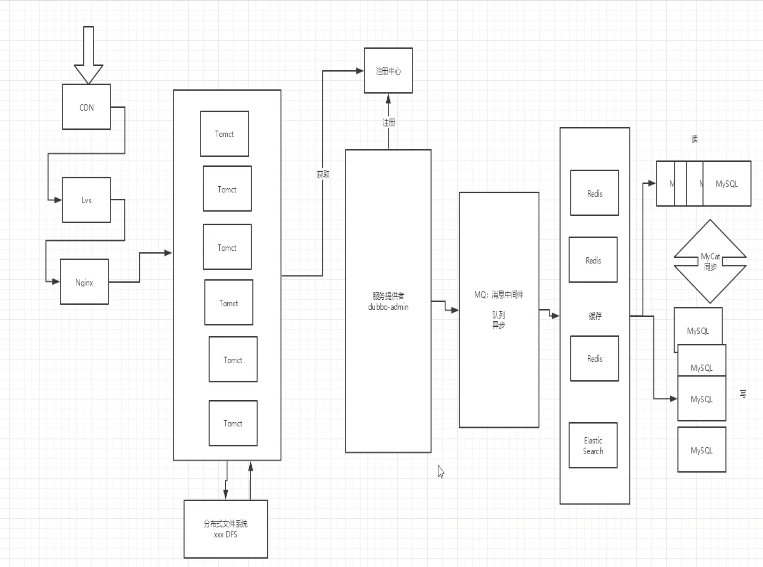
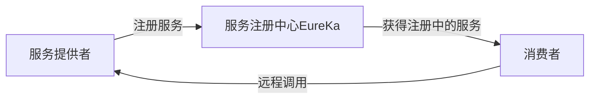
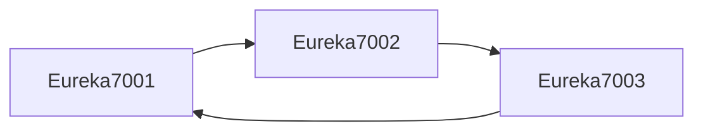

[TOC]

# SpringCloud

现今网站的基本架构：



> SpringCloud和SpringCloud的关系？
>
>SpringBoot注重开发单个为服务，而SpringCloud用于协调各个微服务模块

缺点：

* 数据一致性
* 运维成本高
* 服务间通讯成本

> 学习网站：
>
> * [SpringCloud Netflix](https://docs.spring.io/spring-cloud-netflix/docs/2.2.5.RELEASE/reference/html/)
> * [Springcloud中文社区](https://www.springcloud.cc/)
> * [Springcloud中文官方文档](https://www.springcloud.cc/spring-reference.html)
> * [中国社区](http://springcloud.cn/)

 ## 牛刀小试

### 消费者发起请求

需求：在8001端口创建了一个服务，如何在用80端口的消费者中使用该服务？

用Restful请求，==RestTemplate==（提供多种便捷访问远程http服务的方法，简单的Restful服务模版）

1. 在@configuration中注册服务

   ```java
   @Configuration
   public class ConfigBean{
     @Bean
     public RestTemplate getRestTemplate(){
   	return new RestTemplate();
     }
   }
   ```

2. `@Autowired`在controller中通过自动装配取得bean .

   ```java
   @Autowired
   Private RestTemplate restTemplate;
   
   //url写死！
   private static final String REST_URL_PREFIX="http://localhost:8001"
   
     
   @RequestMapping("/consumer/dept/get/{id}")
   public Dept get(@PathVariable("id") long id){
     //todo
   	reutrn restTemplate.getForObject(REST_URL_PREFIX+"/dept/get/"+id,Dept.class)
   }
   
   @RequestMapping("/consumer/dept/add")
   public boolean add(Dept,dept){
   	return restTemplate.postForObject(REST_URL_PREFIX+"/dept/add",dept,Boolean.class);
   }
   ```

   

 ## Eureka 服务注册，类比Zookeeper

> Eureka能够帮助我们监控服务是否存活，通过心跳测试，定期向服务提供者发送信号，监测返回来判断服务是否正常




三大角色：

* Eureka Server：服务注册与发现
* Service provider：服务提供者
* Service comsumer：服务消费者

### Eureka application.yml注册。

> 将Eureka服务开启。

在配置文件中注册好Eureka的服务：

```yaml
server:
  port: 7001

#Eureka配置
eureka:
  instance:
    hostname: localhost #Eureka服务端的实例名字
  client:
    register-with-eureka: false #表示是否向 Eureka 注册中心注册自己(这个模块本身是服务器,所以不需要)
    fetch-registry: false #fetch-registry如果为false,则表示自己为注册中心
    service-url: #监控页面~
      #重写Eureka的默认端口以及访问路径 --->http://localhost:7001/eureka/
      defaultZone: http://${eureka.instance.hostname}:${server.port}/eureka/

```

写入主启动类：

```java
//启动之后，访问 http://localhost:7001/
@SpringBootApplication
@EnableEurekaServer //EnableEurekaServer 表示是 Eureka服务端的启动类，可以接受别人注册进来~
public class EurekaServer_7001 {
    public static void main(String[] args) {
        SpringApplication.run(EurekaServer_7001.class,args);
    }
}
```

### 将自己服务提供者注册进Eureka

1. 在pom中导入Eureka依赖

   ```xml
   <!--Eureka依赖-->
   <!-- https://mvnrepository.com/artifact/org.springframework.cloud/spring-cloud-starter-eureka -->
   <dependency>
       <groupId>org.springframework.cloud</groupId>
       <artifactId>spring-cloud-starter-eureka</artifactId>
       <version>1.4.6.RELEASE</version>
   </dependency>
   
   ```

2. 分别在provider和Eureka的服务中的配置文件中写好

   1. 在provider的yaml文件中写入注册配置：

      ```yaml
      # Eureka配置：配置服务注册中心地址
      eureka:
        client:
          service-url:
            defaultZone: http://localhost:7001/eureka/
        instance:
          instance-id: springcloud-provider-dept-8001 #修改Eureka上的默认描述信息
      ```

   2. 在==provider==主启动类中加上`@EnableEurekaClient`

   3. 配置info来查看服务信息

### Eureka自我保护机制：

> ==好死不如赖活着==
>
> 一句话总结就是：**某时刻某一个微服务不可用，eureka不会立即清理，依旧会对该微服务的信息进行保存！**
>
> - 默认情况下，当eureka server在一定时间内没有收到实例的心跳，便会把该实例从注册表中删除（**默认是90秒**），但是，如果短时间内丢失大量的实例心跳，便会触发eureka server的自我保护机制，比如在开发测试时，需要频繁地重启微服务实例，但是我们很少会把eureka server一起重启（因为在开发过程中不会修改eureka注册中心），**当一分钟内收到的心跳数大量减少时，会触发该保护机制**。可以在eureka管理界面看到Renews threshold和Renews(last min)，当后者（最后一分钟收到的心跳数）小于前者（心跳阈值）的时候，触发保护机制，会出现红色的警告：**EMERGENCY!EUREKA MAY BE INCORRECTLY CLAIMING INSTANCES ARE UP WHEN THEY’RE NOT.RENEWALS ARE LESSER THAN THRESHOLD AND HENCE THE INSTANCES ARE NOT BEGING EXPIRED JUST TO BE SAFE.**从警告中可以看到，eureka认为虽然收不到实例的心跳，但它认为实例还是健康的，eureka会保护这些实例，不会把它们从注册表中删掉。
> - 该保护机制的目的是避免网络连接故障，在发生网络故障时，微服务和注册中心之间无法正常通信，但服务本身是健康的，不应该注销该服务，如果eureka因网络故障而把微服务误删了，那即使网络恢复了，该微服务也不会重新注册到eureka server了，因为只有在微服务启动的时候才会发起注册请求，后面只会发送心跳和服务列表请求，这样的话，该实例虽然是运行着，但永远不会被其它服务所感知。所以，eureka server在短时间内丢失过多的客户端心跳时，会进入自我保护模式，该模式下，eureka会保护注册表中的信息，不在注销任何微服务，当网络故障恢复后，eureka会自动退出保护模式。自我保护模式可以让集群更加健壮。
> - 但是我们在开发测试阶段，需要频繁地重启发布，如果触发了保护机制，则旧的服务实例没有被删除，这时请求有可能跑到旧的实例中，而该实例已经关闭了，这就导致请求错误，影响开发测试。所以，在开发测试阶段，我们可以把自我保护模式关闭，只需在eureka server配置文件中加上如下配置即可：**eureka.server.enable-self-preservation=false**

  ### Eureka 集群环境搭建

鸡蛋不能都帮在一个篮子里，如果一个服务注册中心出问题了，可以用其他的Eureka服务中心替代。


三个节点==相互依赖==配置：



因此，一个provider被注册到三个子节点上，如果一个节点挂了，其他两个子节点中还是有注册的服务，不会影响服务提供

### Eureka的CAP原则

* Consistency：一致性
* Availability：可用性
* Partition tolerance：分区容错性

Zookeeper保证的是==CP==:

在Master节点宕机时，会进行投票重新从节点中选出Leader，十分耗时，所以可用性不能保证。

Eureka保证的是==AP==：

优先保证可用性，==各个节点时平等的==。因为每个服务provider都将服务注册到了每个节点中，一个挂了自动切换到其他节点。只是查到的数据不是最新的

## Ribbon 客户端负载均衡

类比：nginx/apache+tomcat/lvs

恶心的移动就是用lvs

为客户端提供一些简单的负载均衡算法。

负载均衡的方法：

* 轮询
* 随机

### 牛刀小试

在消费者（80）中注册Ribbon

1. 写配置

   ```xml
   <!--Ribbon-->
   <dependency>
       <groupId>org.springframework.cloud</groupId>
       <artifactId>spring-cloud-starter-ribbon</artifactId>
       <version>1.4.6.RELEASE</version>
   </dependency>
   <!--Eureka: Ribbon需要从Eureka服务中心获取要拿什么-->
   <dependency>
       <groupId>org.springframework.cloud</groupId>
       <artifactId>spring-cloud-starter-eureka</artifactId>
       <version>1.4.6.RELEASE</version>
   </dependency>
   
   ```

2. yaml配置

   ```yaml
   # Eureka配置
   eureka:
     client:
       register-with-eureka: false # 不向 Eureka注册自己
       service-url: # 从三个注册中心中随机取一个去访问
         defaultZone: http://eureka7001.com:7001/eureka/,http://eureka7002.com:7002/eureka/,http://eureka7003.com:7003/eureka/
   ```

3. 配置负载均衡实现RestTemplate

   ```java
   @Configuration
   public class ConfigBean {//@Configuration -- spring  applicationContext.xml
   
       @LoadBalanced //配置负载均衡实现RestTemplate
       @Bean
       public RestTemplate getRestTemplate() {
           return new RestTemplate();
       }
   }
   ```

4. 在主启动类上加上开启Eureka的注解，为了实现负载均衡

   ```java
   //Ribbon 和 Eureka 整合以后，客户端可以直接调用，不用关心IP地址和端口号
   @SpringBootApplication
   @EnableEurekaClient //开启Eureka 客户端
   public class DeptConsumer_80 {
       public static void main(String[] args) {
           SpringApplication.run(DeptConsumer_80.class, args);
       }
   }
   ```

5. 将controller中的url修改为服务注册中心：

   ```java
   //Ribbon:我们这里的地址，应该是一个变量，通过服务名来访问
   //private static final String REST_URL_PREFIX = "http://localhost:8001";
   private static final String REST_URL_PREFIX = "http://SPRINGCLOUD-PROVIDER-DEPT";
   
   ```

6. 实现负载均衡 

Ribbon实现原理：


使用默认的随机轮询算法：

```java
@Configuration
public class ConfigBean {//@Configuration -- spring  applicationContext.xml

    /**
     * IRule:
     * RoundRobinRule 轮询
     * RandomRule 随机
     * AvailabilityFilteringRule ： 会先过滤掉，跳闸，访问故障的服务~，对剩下的进行轮询~
     * RetryRule ： 会先按照轮询获取服务~，如果服务获取失败，则会在指定的时间内进行，重试
     */
    @LoadBalanced //配置负载均衡实现RestTemplate
    @Bean
    public RestTemplate getRestTemplate() {
        return new RestTemplate();
    }

    @Bean
    public IRule myRule(){
        return new RandomRule();//使用随机规则
    }
}

```


### 自定义负载均衡算法

自己写的组件不能放在主启动类的同级包中，Spring通过@Bean下的返回值进行判断配置

1. ```java
   /**
    * @Auther: csp1999
    * @Date: 2020/05/19/11:58
    * @Description: 自定义规则
    */
   @Configuration
   public class MyRule {
   
       @Bean
       public IRule myRule(){
           return new MyRandomRule();//默认是轮询RandomRule,现在自定义为自己的
       }
   }
   
   ```

2. 在主启动类中开启负载均衡指定自定义的MyRule配置类：

   ```java
   //Ribbon 和 Eureka 整合以后，客户端可以直接调用，不用关心IP地址和端口号
   @SpringBootApplication
   @EnableEurekaClient
   //在微服务启动的时候就能加载自定义的Ribbon类(自定义的规则会覆盖原有默认的规则)
   @RibbonClient(name = "SPRINGCLOUD-PROVIDER-DEPT",configuration = MyRule.class)//开启负载均衡,并指定自定义的规则
   public class DeptConsumer_80 {
       public static void main(String[] args) {
           SpringApplication.run(DeptConsumer_80.class, args);
       }
   }
   
   ```

3. 自定义规则，参考Ribbon的默认规则来改

   ```java
   public class MyRandomRule extends AbstractLoadBalancerRule {
   
       /**
        * 每个服务访问5次则换下一个服务(总共3个服务)
        * <p>
        * total=0,默认=0,如果=5,指向下一个服务节点
        * index=0,默认=0,如果total=5,index+1
        */
       private int total = 0;//被调用的次数
       private int currentIndex = 0;//当前是谁在提供服务
   
       //@edu.umd.cs.findbugs.annotations.SuppressWarnings(value = "RCN_REDUNDANT_NULLCHECK_OF_NULL_VALUE")
       public Server choose(ILoadBalancer lb, Object key) {
           if (lb == null) {
               return null;
           }
           Server server = null;
   
           while (server == null) {
               if (Thread.interrupted()) {
                   return null;
               }
               List<Server> upList = lb.getReachableServers();//获得当前活着的服务
               List<Server> allList = lb.getAllServers();//获取所有的服务
   
               int serverCount = allList.size();
               if (serverCount == 0) {
                   /*
                    * No servers. End regardless of pass, because subsequent passes
                    * only get more restrictive.
                    */
                   return null;
               }
   
               //int index = chooseRandomInt(serverCount);//生成区间随机数
               //server = upList.get(index);//从或活着的服务中,随机获取一个
   
               //=====================自定义代码=========================
   
               if (total < 5) {
                   server = upList.get(currentIndex);
                   total++;
               } else {
                   total = 0;
                   currentIndex++;
                   if (currentIndex > upList.size()) {
                       currentIndex = 0;
                   }
                   server = upList.get(currentIndex);//从活着的服务中,获取指定的服务来进行操作
               }
   
               //======================================================
   
               if (server == null) {
                   /*
                    * The only time this should happen is if the server list were
                    * somehow trimmed. This is a transient condition. Retry after
                    * yielding.
                    */
                   Thread.yield();
                   continue;
               }
   
               if (server.isAlive()) {
                   return (server);
               }
   
               // Shouldn't actually happen.. but must be transient or a bug.
               server = null;
               Thread.yield();
           }
   
           return server;
   
       }
   
       protected int chooseRandomInt(int serverCount) {
           return ThreadLocalRandom.current().nextInt(serverCount);
       }
   
       @Override
       public Server choose(Object key) {
           return choose(getLoadBalancer(), key);
       }
   
       @Override
       public void initWithNiwsConfig(IClientConfig clientConfig) {
           // TODO Auto-generated method stub
   
       }
   }
   
   ```


## Feign负载均衡

面向接口编程，更加简单。

一个注解加一个配置类就能完成。

### 使用步骤：

1. 在consumer模块中pom导入依赖

   ```xml
   <!--Feign的依赖-->
   <dependency>
       <groupId>org.springframework.cloud</groupId>
       <artifactId>spring-cloud-starter-feign</artifactId>
       <version>1.4.6.RELEASE</version>
   </dependency>
   
   ```

2. 写Controller:

   ```java
   @RestController
   public class DeptConsumerController {
   
       @Autowired
       private DeptClientService deptClientService = null;
   
       @RequestMapping("/consumer/dept/add")
       public boolean add(Dept dept) {
           return this.deptClientService.addDept(dept);
       }
   
       @RequestMapping("/consumer/dept/get/{id}")
       public Dept get(@PathVariable("id") Long id) {
          return this.deptClientService.queryById(id);
       }
   
       @RequestMapping("/consumer/dept/list")
       public List<Dept> list() {
           return this.deptClientService.queryAll();
       }
   }
   
   ```

3. 在Springcloud-api模块中加入service包，该模块可让所有模块都能使用

   > 之所以要将这个下面这个接口写在consumer模块之外的原因是在开发过程中要遵守设计原则，里氏原则，在consumer模块中应当在只负责处理请求，而不做别的事情

4. ```xml
   <!--Feign的依赖-->
   <dependency>
       <groupId>org.springframework.cloud</groupId>
       <artifactId>spring-cloud-starter-feign</artifactId>
       <version>1.4.6.RELEASE</version>
   </dependency>
   
   ```

5. 在service包下新建接口

   ```java
   //@FeignClient:微服务客户端注解,value:指定微服务的名字,这样就可以使Feign客户端直接找到对应的微服务
   @FeignClient(value = "SPRINGCLOUD-PROVIDER-DEPT")
   public interface DeptClientService {
   
       @GetMapping("/dept/get/{id}")
       public Dept queryById(@PathVariable("id") Long id);
   
       @GetMapping("/dept/list")
       public Dept queryAll();
   
       @GetMapping("/dept/add")
       public Dept addDept(Dept dept);
   }
   
   ```

6. 在consumer的主启动类下多写这几个注解

   ```java
   @SpringBootApplication
   @EnableEurekaClient
   //feign客户端注解,并指定要扫描的包以及配置接口DeptClientService
   @EnableFeignClients(basePackages = {"com.haust.springcloud"})
   //扫描所有自己的包,让所有注解也能生效
   @ComponentScan("com.haust.springcloud")
   public class FeignDeptConsumer_80 {
       public static void main(String[] args) {
           SpringApplication.run(FeignDeptConsumer_80.class, args);
       }
   }
   
   ```

   

