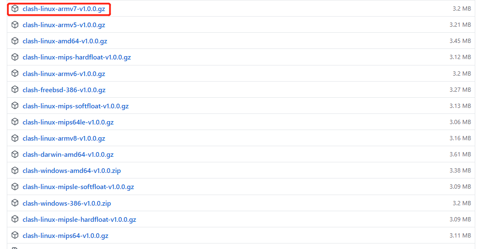
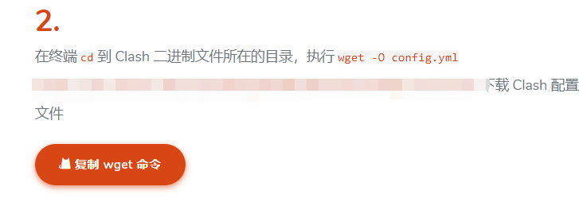

# 在树莓派下安装Clash（zo2ll.cn）
同时适用于配置其他linux发行设备
## 需要准备的软件
* 树莓派3b+
* zo2ll.cn 的vps 服务器账号，可在网站上先购买
###

1. 先在 /home/pi 用户目录下创一个名为clash的文件夹，mkdir clash
2. [github网址下载clash压缩包](https://github.com/Dreamacro/clash/releases)


3. 在解压的过程中，遇到了问题（踩坑）
```
tar: 它似乎不像是一个 tar 归档文件
tar: 跳转到下一个头
tar: 由于前次错误，将以上次的错误状态退出
```
通过万能的google 百度大法，发现原来这是个gzip类型的压缩包，所以应该使用
```
sudo gunzip  这是填写clash压缩包的名称
```
4. 解压完成后，解压出来的clash 放入bin中配置成环境
```
sudo mv clash-linux-armv7-v0.20.0 /usr/local/bin/clash //移动并重命名，简短方便使用
```
5.然后就可以在命令行执行 clash了，但是一定会报错，因为此时还没有配置config
如果执行了，在命令行会先提示缺少配置文件
6.所以我们要从zo2ll.cn上下载配置好的config.yaml
7.如果直接执行zo2ll.cn上提供的
```
 wget -O config.yml xxxxxxxx
```


会出现被重定向的而无法下载的问题，所以我们要先从windows上手动下载：直接在浏览器上手动输入网址
，直接输入马赛克部分，也就是你专属的配置文件
8. 下载完成后，先将文件拷入优盘当中，退出优盘后再插入树莓派上，随后执行
```
sudo fdisk -f  #先查看自己u盘在树莓派的位置
sudo mount /dev/sda1 /dev/mnt #将U盘进行挂载
mv  config.yml ~/clash #将配置文件转移到clash文件夹下
```
9.再次执行指令``` clash -d /home/pi/clash``` 告诉clash 去访问我们配置文件。但是还是会出现错误提示缺少mmdb，而且应为有墙的缘故也没办法在线下载
10.所以可以采用在上面相似的办法，在google找到一份 Country.mmdb然后下载到windows上后再通过U盘挂载拷入到和config.yaml相同的文件夹。
11. 一切准备就去，再次运行命令 ``` clash -d /home/pi/clash``` ,如果正常运行成功，尝试在树莓派上打开浏览器然后访问 [link](http://clash.razord.top), 进行配置设置。
### 待解决的问题
1. http://clash.razord.top 无法正常访问
2. 如何在树莓派设置永久的代理，而不是每次通过指令
3. ``` chromium-browser --proxy-server="proxy-host:proxy-port"``` 来打开被代理的服务器