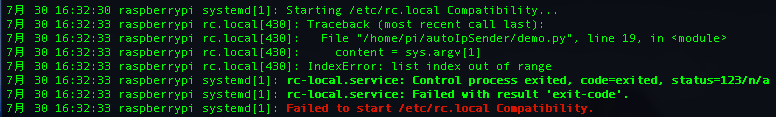
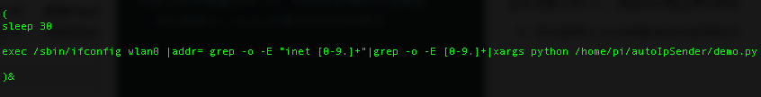

# 踩坑实录2:让树莓派开机自动发送本机ip地址到局域网下
前几天一次家里的路由器突然宕机导致重启后家中的设备的都ip地址都重新分配了一次，这是我就发现如果我的树莓派连接不上，原因显而易见是因为ip地址不符。那么如何重新获得统一局域网络下树莓派的ip地址呢？
有很多种方式可以实现这个需求
1. 通过在windows上使用ipscanner来搜寻统一局域网下的所有设备的ip地址
* 缺点是：家庭中所使用的小心居于网络下的设备数量有限，很容易就能获取树莓派的ip,可我们如果处在A类网段下，且有多台树莓派设配的情况下，那么寻找树莓派的ip地址将是一个很漫长的过程。
2. 通过手机端的局域网ip地址扫描软件
* 缺点：和第一条同理

那么是否能让树莓派自己报出自己的ip地址呢？
## 让树莓派开机发送一个含有自己ip的邮件到指定邮箱
有了想法，就可以开始思考实现需求了
* 一个能自动发送有邮件的程序或脚本
* 能够获取树莓派ip地址的命令行
* 能够让树莓派开机自动运行的脚本
### 逐步分析
1. 通过python的发送smtp邮件
2. 通过命令行`ifconfig wlan0 | grep -o -E "inet [0-9.]+"| grep -o -E [0-9.]+` 进行ip地址的获取
3. 将参数传递给python进行执行
4. 通过设置/etc/rc.local实现开机自动运行

### 踩坑实录
* 在树莓派上先运行了一遍
```
 $ /sbin/ifconfig wlan0 |addr= grep -o -E "inet [0-9.]+"|grep -o -E [0-9.]+|xargs python /home/pi/autoIpSender/demo.py
```
邮件能够成功的发送，看似好像十分顺利，可将这个脚本添加到rc.local后就没效果了

随机打开了`sudo systemctl status rc-local` 查看rc.local的运行状态码。果然有错误

，可我的参数刚刚自测的时候是好好的呀
* 然后便开始了google，百度的漫长搜索之旅....
* 最好我想到会不会是执行脚本的时间，要先于wifi连接的时间，导致IP地址无法获取，从而造成argz[1]没有值
* 于是乎我先在～/ 目录下创建了一个
```
touch test.txt
```
文档用于存放获取到的ip。然后将rc.local中的脚本改为
```
 $ /sbin/ifconfig wlan0 |addr= grep -o -E "inet [0-9.]+"|grep -o -E [0-9.]+|xargs echo >> test.txt

```
意思是在开机启动时将获取到的ip地址写在test.txt文件的最后,再次开机结果居然是空！（文件总行数为1，而且是空行），这更加肯定了我的猜想，树莓派在刚启动时还并没有连接上Wi-Fi，也就没有相应的ip地址
* 所以我将rc.local的脚本改为定时执行
写在括号中加上&表示在后台运行不让线程等待
* 再次重启，成功！