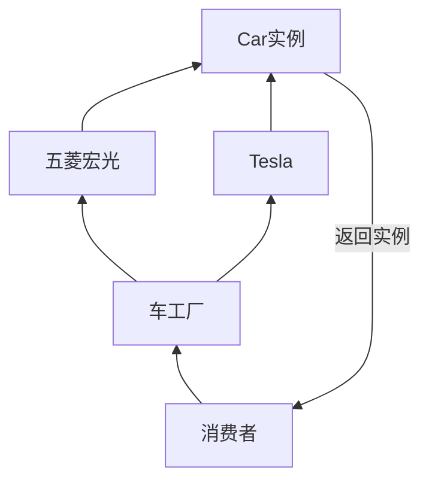
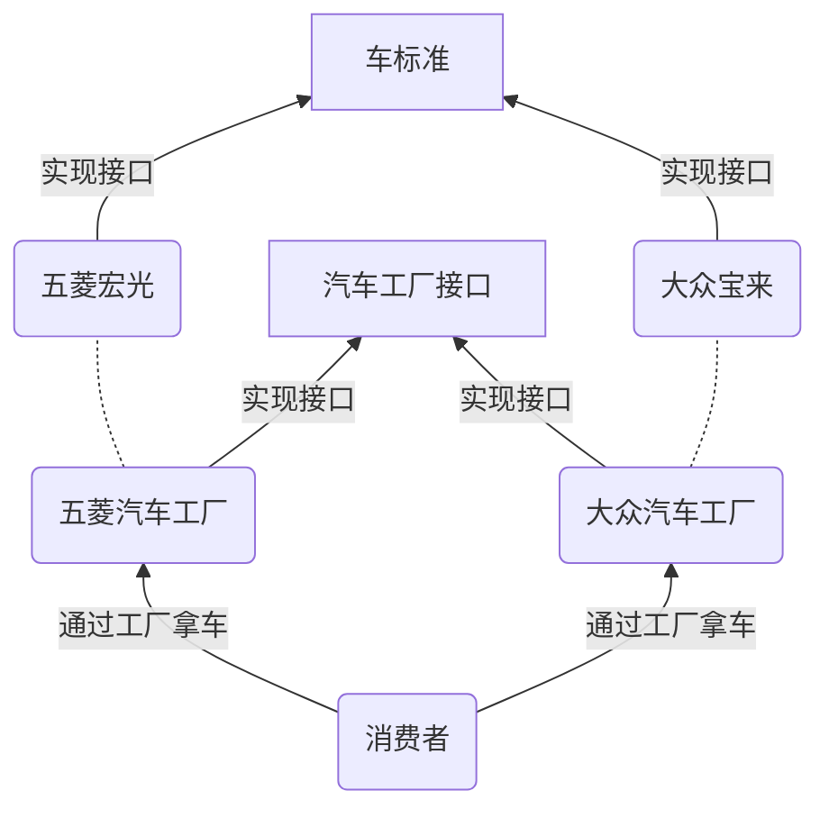
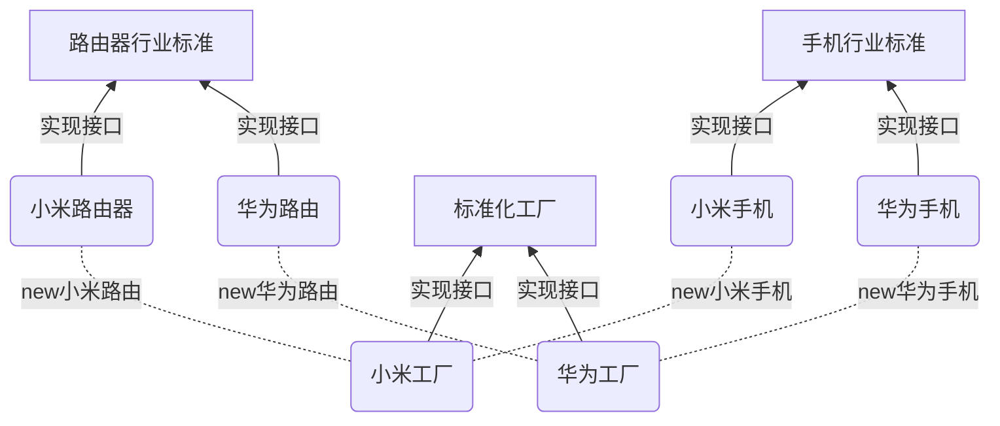
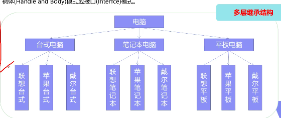

[TOC]

# 设计模式

* 创造型模式：单例模式、工厂模式、抽象工厂模式、建造者模式、原型模式
* 结构型模式：适配型模式，桥接模式，静态代理模式，动态代理模式
* 行为型模式：

## OOP七大原则：

* 开闭原则：一个软件的实体应当对扩展开放，对修改关闭
* 里氏替换原则：继承时尽量不重写方法，而是重写写一个方法调用父类方法
* 依赖倒转原则：要针对接口编程，依赖抽象，降低耦合
* 单一职责原则：一个对象不应该承担太多职责，一个方法尽可能干好一件事情
* 接口隔离原则：拆分接口，细化接口
* 迪米特法则：类与类之间不要直接进行通信，而是通过第三方类进行中介交流。适配器模式
* 合成复用原则：先考虑组合，桥接模式，再考虑继承的关系，继承关系又要保证里氏原则

***

## 创造型模式：

### 工厂模式：

要根据需求使用最适合业务的工厂模式，一味地的满足oop会提高复杂度

应用场景：

* JDK中的Calendar的getinstance方法
* JDBC中的Connection对象的获取
* SpringIOC中IOC容器创建管理bean对象
* 反射中Class对象的newInstance方法

#### 简单工厂

> 实例化对象不用new，而使用工厂创建
>
> 通过接收不同的参数，返回相应的实例

优点：结构简单，代码复杂度简单易于管理，都在一个类中管理

缺点：不满足开闭原则，如果要扩展业务就必须要修改原代码




#### 工厂方法模式

> 通过实现接口，可以动态的扩展
>
> 为工厂制定标准




#### 抽象工厂模式

> 产品族和产品等级的概念 



==优点==：

* 一个工厂能够生产一个产品族，如小米工厂可以生产小米的手机，路由器，卡丁车等等
* 具体的类之间代码隔离，无需关注创建的细节
* 在同一产品等级上，例如现在vivo也要生产手机，只需要实现手机的接口，然后通过实现工厂接口创造自己的工厂即可，但也没办法满足开闭原则

==缺点==：

* 但是在同一产品族上进行扩展时略显吃力，例如小米现在准备生产电脑，会经历这样的流程
   * 制定一个电脑行业标准的接口（满足开闭原则）
   * 实现一个小米电脑的类（满足开闭原则）
   * 将小米电脑的生产加入小米的工厂（不满足！此时一定会修改小米工厂的源代码）
* 在理解上也相对其他工厂模式吃力很多，特别是在产品链庞大的情况下

### 建造者模式

> 创建对象的最佳方式，可以理解为通过一个中介或者说是导演类帮你创建对象，你和他说你的需求，他直接返回给你的需要的产品

和抽象工厂模式的区别是什么呢？

* 抽象工厂模式可以说是厂家拿货，大多数时候不能定制产品，比如你要了小米10这部手机你得到的就和大家都一样是一步128g的小米10
* 而建造者模式相当于NikeId，Vans的Customize，能够定制化你的产品

==优点==： 

* 建造和表示分离，用户不需要知道内部产品的细节
* 结偶
* 建造者类之间相互独立，有利于系统的扩展。可以这样理解，你现在要定制一双鞋子，那么你能够选择的鞋型，颜色，鞋带样式等等，虽然是可以选择的，但也是有限的，建造者只需要把你的需求组合起来发给厂家，厂家直接拿着现成的材料生产你的鞋子就好了

==缺点==：

* 产品差异性过大，没办法使用建造者模式。例如你不能让nike帮你定制一部手机
* 差异性会导致系统变得庞大，代码变得难以管理

### 原型模式

* 克隆
* Prototype
* Cloneable接口
* clone()

SpringBean : 单例模式，原型模式

#### 浅拷贝

> Java中clone()方法是浅拷贝，拷贝出来的对象虽然拥有不同的hash值，但是实际上指向的内存还是原来的对象，在更改克隆对象的值后，原来对象的值也会随着改变

#### 深拷贝

> 改造拷贝方法clone()

* 改造拷贝方法
* 序列化后再返序列化

## 结构性模式

### 适配器模式

> * Springboot autoconfig
> * Gui
> * Android

>```mermaid
>graph LR
>
>InputStream(InputStream)--> |字节输入|InputStreamReader(InputStreamReader)
>InputStreamReader(InputStreamReader)-->|输出字符| BufferReader
>```
>
>Java IO流中的InputStreamReader就是很好的例子，本来字节流的输入特别麻烦，需要一个一个字节的读取，而使用时InputStreamReader后就可以将字节的输入转换为字符的输出。InputStreamReader就是扮演了适配器的角色

### 桥接模式/柄体模式/接口模式

> 用组合的方式代替继承，继承违背了单一职责的原则
>
> * java的跨平台
> * AWT中的peer架构
> * JDBC驱动程序，一个驱动程序连接多个不同的数据库类型
>
> 缺点：
>
> * 会增加系统的理解与设计难度

将原本耦合的关系，分别抽取出来，让他们解除耦合

原本的产品和品牌间的关系：



> 转换为桥接模式后：
>
> ```mermaid
> graph BT
> Client --> computer
> Client --> Brand
> computer[电脑]
> 台式机 --> |实现接口|computer
> 手表 --> |实现接口|computer
> 笔记本 --> |实现接口|computer
> Brand[品牌]
> 联想 --> |实现接口|Brand
> 戴尔 --> |实现接口|Brand
> 苹果 --> |实现接口|Brand
> computer -.-> |桥接|Brand
> ```
>
> 如此一来，就实现了品牌和电脑之间的接耦，如果要扩展电脑类型就实现电脑的接口，扩展品牌就实现品牌的接口。

### 代理模式

> ==AOP==（Aspect Oriented Programming） 面向切面编程

#### 静态代理模式

角色分析：

* 抽象角色：一般会使用接口或者抽象类来解决
* 真实角色：被代理的角色
* 代理角色：代理真实角色后，一般会做一些附属操作
* 客户：防护代理对象的人

优点：

* 可以使真实橘色的操作更加存粹，不用去关注公共业务
* 实现了业务的分工
* 发生扩展时放拜年集中管理

缺点：

### 动态代理

* 动态代理和静态代理角色一样

* 动态代理的代理类是动态生成的，不是我们直接写好的

* 动态代理分为两类：基于接口的动态代理，基于类的动态代理

   * 基于接口：JDK动态代理
   * 基于类：cglib

   优点：

   * 一个动态代理类代理的是一个接口，一般就是对应一类业务
   * 一个动态代理类可以代理多个接口，只要是实现了同一个接口即可

   ```java
   public class ProxyInvocationHandler implements InvocationHandler{
     //被代理的接口
     private Object target;
     
     public void setTarget(Object target){
       this.target=target;
     }
     
     //生成代理类
     public Object getProxy(){
    //这个方法写死，用来获得被代理后的对象   
    return Proxy.newProxyInstance(this.geClass().getClassLoader(),target.getClass().getInterface(),this);
      }
     
     public Object invoke(Object proxy,Method method, Object[] args) throws Throwable{
       //方法执行前，可添加前置日志
       Object result=method.invoke(target,args);
       //方法执行后，可添加后置日志  
       return result;
     }
   }
   ```

   

> AOP:
>
> ```mermaid
> graph TB
> dao --> service
> service --> controller
> controller --> front
> 
> ```
>
> 